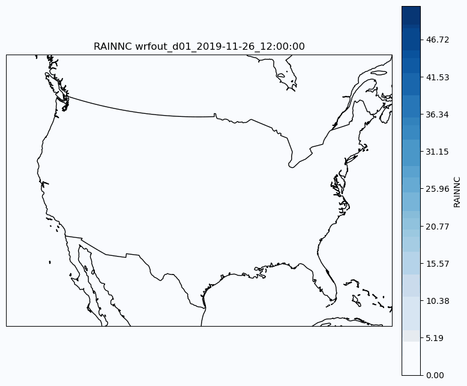

# Run Your First Simulation
This tutorial will show you how to run WRF simulations using the Inductiva API.

We will cover the publicly available [WRF benchmark](https://www2.mmm.ucar.edu/wrf/users/benchmark/v44/benchdata_v44.html), based on the [Pre-Thanksgiving Winter Storm of 2019](https://weather.com/storms/winter/news/2019-11-24-snowstorm-rockies-denver-plains-midwest-thanksgiving-week), to help you get started with simulations.

We will also demonstrate Inductiva’s ability to efficiently scale this use case on a more powerful machine.

<p align="center"></p>

## Prerequisites
Download the required files [here](https://www2.mmm.ucar.edu/wrf/users/benchmark/v44/v4.4_bench_conus12km.tar.gz)
and place them in a folder called `SimulationFiles`. Then, you’ll be ready to send
your simulation to the Cloud.

## Running a WRF Simulation
Here is the code required to run a WRF simulation using the Inductiva API:

```python
"""WRF Simulation."""
import inductiva

# Allocate cloud machine on Google Cloud Platform
cloud_machine = inductiva.resources.MachineGroup( \
    provider="GCP",
    machine_type="c2d-standard-16",
    spot=True)

# Initialize the Simulator
wrf = inductiva.simulators.WRF( \
    version="4.6.1")

# Run simulation
task = wrf.run( \
	input_dir=input_dir,
	case_name="em_real",
	# generate GIF with the RAINNC values
	gen_gif=True,
	gen_gif_variable="RAINNC",
	gen_gif_files=[
		"wrfout_d01_2019-11-26_12:00:00",
		"wrfout_d01_2019-11-26_13:00:00",
		"wrfout_d01_2019-11-26_14:00:00",
		"wrfout_d01_2019-11-26_15:00:00",
		"wrfout_d01_2019-11-26_16:00:00",
		"wrfout_d01_2019-11-26_17:00:00",
		"wrfout_d01_2019-11-26_18:00:00",
		"wrfout_d01_2019-11-26_19:00:00",
		"wrfout_d01_2019-11-26_20:00:00",
		"wrfout_d01_2019-11-26_21:00:00",
		"wrfout_d01_2019-11-26_22:00:00",
		"wrfout_d01_2019-11-26_23:00:00",
		"wrfout_d01_2019-11-27_00:00:00",
	],
	on=cloud_machine)


# Wait for the simulation to finish and download the results
task.wait()
cloud_machine.terminate()

task.download_outputs()
task.print_summary()
```

**Note**: `spot` machines are a lot cheaper but may be terminated by the provider if necessary.

For visualization purposes, this script also optionally generates a GIF directly from the simulation outputs.
Check out this [tutorial](https://inductiva.ai/guides/wrf/gif-generation) for more details.

To adapt this script for other WRF simulations, replace input_dir with the path
to your WRF input files and set the `case_name` accordingly.

When the simulation is complete, we terminate the machine, download the results and 
print a summary of the simulation as shown below.

```
Task status: Success

Timeline:
	Waiting for Input         at 29/05, 17:44:37      333.949 s
	In Queue                  at 29/05, 17:50:11      0.008 s
	Preparing to Compute      at 29/05, 17:50:11      27.198 s
	In Progress               at 29/05, 17:50:38      1924.838 s
		├> 2.09 s          /scripts/create_links.sh /WRF/test/em_real
		├> 1888.972 s      /opt/openmpi/4.1.6/bin/mpirun --use-hwthread-cpus ./wrf.exe
		└> 1.079 s         /scripts/delete_links.sh
	Finalizing                at 29/05, 18:22:43      52.533 s
	Success                   at 29/05, 18:23:36      

Data:
	Size of zipped output:    3.62 GB
	Size of unzipped output:  3.66 GB
	Number of output files:   52

Estimated computation cost (US$): 0.072 US$
```

As you can see in the “In Progress” line, the part of the timeline that
represents the actual execution of the simulation, the core computation time of
this simulation was approximately 1924.8 seconds (32 minutes).

Although it's short, there's still room for improvement to reduce the processing
time.

## Scaling Up Your Simulation
Scaling up your simulation is as simple as updating the `machine_type` parameter to a 56 vCPU machine (`c2d-highcpu-56`).

By increasing the number of vCPUs, we can substantially decrease the simulation time.

Here are the results of running the same simulation on a few machines:

|  Machine Type  | Virtual CPUs |Execution Time| Estimated Cost |
|:--------------:|:------------:|:------------:|:--------------:|
|  c2d-highcpu-16 |       16      | 32 minutes 5 seconds | 0.072 US$    |
|  c2d-highcpu-56 |       56      | 14 minutes 15 seconds | 0.11 US$    |
| c2d-highcpu-112 |      112      | 8 minutes 37 seconds  | 0.14 US$    |

Still in the testing phase? No problem! Just skip this step for now and start
with a machine with fewer vCPUs. Once you're satisfied with your results, you
can seamlessly scale your WRF simulation.

## Summary
We’ve walked through the essential steps for setting up and running a WRF simulation using the **Inductiva API**.

By following this guide, you should now have a clear understanding of how to configure and efficiently 
run WRF simulations on Inductiva.

Happy simulationg! 🌪️
