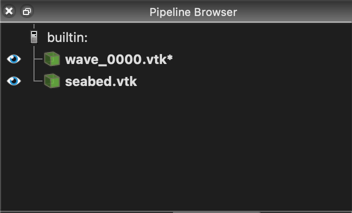

# XBeach Visualizations with ParaView
As an example, consider the  tutorial. -> se já não vier de um tutorial já feito, contextualizar melhor

By the end of that tutorial, your simulation will have completed, and the results will be downloaded to the `inductiva_output` folder on your local machine.

This guide will focus on creating a ParaView visualization from those simulation results.

## Visualizing the Results with ParaView
Visualizing your simulation with ParaView is simple and straightforward.

First, open ParaView and go to the menu `File` > `Open...`. Navigate to your
simulation results folder, then to `CaseDambreak3D_FSI_out/particles`, and select the three Groups named `PartFluid_..vtk`, `PartGate_..vtk` and `PartStructure_..vtk`. -> dar update, isto está para o dsph

<em>Figure 1: File -> Open</em>

 -> dar update, isto está para o dsph

<em>Figure 2: Selecting the files</em>

Once all files are loaded, make them visible by clicking the **eye** icon in the **Pipeline Browser** 
on the left side of the screen.

 -> dar update, isto está para o dsph

<em>Figure 3: Make files visible</em>

Next, position your camera by clicking the `set view direction +Y` button in the toolbar.

<em>Figure 4: Move the camera to the correct position</em>

Now you can press the **Play** button in the toolbar to watch your simulation run in real time.

 -> dar update, isto está para o dsph

<em>Figure 5: Simulation running</em>

## Choosing What Data to Visualize -> dar update, isto está para o dsph
In the previous section, we visualized the particles using ParaView’s default settings. A key part of analyzing your simulation is choosing which data to visualize. For example, DualSPHysics allows you to visualize particle velocity, depending on what data was saved during the simulation.

To do this, select `PartFluid_0000.vtk*` in the **Pipeline Browser** and change the dropdown menu above from `idp` to `Vel`.

<em>Figure 6: Changing idp to Vel</em>

<em>Figure 7: Simulation running with velocity visible</em>

You can save your animation by going to **File > Save Animation...** and choosing your preferred format.