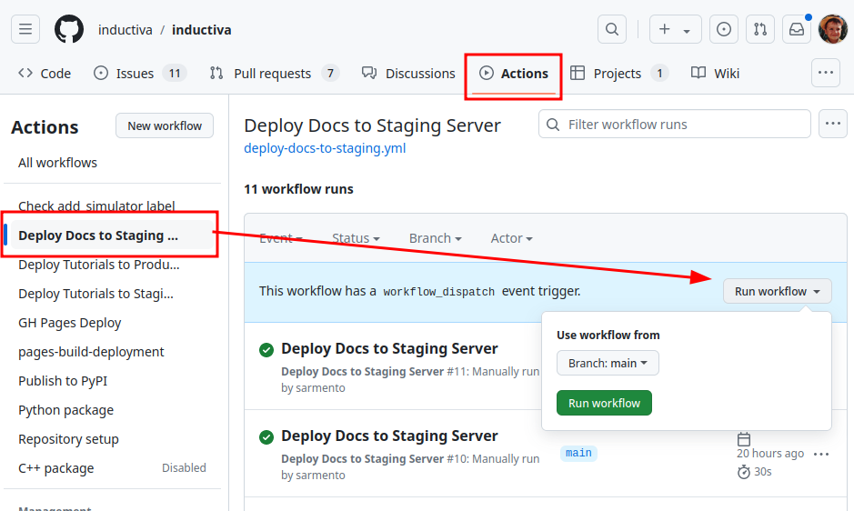

# Inductiva Documentation

## Documentation build tips

When working on the documentation it can be rather useful to run a local
build of the static site and have it reload when any changes are detected.

This can be performed in a very straightforward way using [sphinx-autobuild](https://github.com/sphinx-doc/sphinx-autobuild#readme)

### Set Python 3.8 as the local Python version for the build

We'll be using [PyEnv](https://github.com/pyenv/pyenv) for this first step but
feel free to use any other Python version manager.

```console
brew update
brew install pyenv
cd docs
pyenv install 3.8
pyenv local 3.8
```

### Install `sphinx-autobuild`

```console
pip install sphinx-autobuild
```

### Launch a local documentation build and monitor it for changes

```console
sphinx-autobuild . /tmp/inductiva-docs -W
```

* `sphinx-autobuild . /tmp/inductiva-docs` will build the docs and watch for
changes
* `-W` will handle [warnings as errors](https://www.sphinx-doc.org/en/master/man/sphinx-build.html#cmdoption-sphinx-build-W)

## Deployment

### Production

Deployments to the production environment are **triggered automatically** whenever
code is pushed to either `main` or `development` branches.

These branches have different deployment targets:

* `main` deploys to [latest](https://docs.inductiva.ai/en/latest/)
* `development` deploys to [development](https://docs.inductiva.ai/en/development/)

### Staging

Deploying to the [staging environment](https://docs.staging.inductiva.ai/) is
**performed manually** via GitHub actions.

1. Go over to the [repository page](https://github.com/inductiva/inductiva/)
2. Select the [Actions](https://github.com/inductiva/inductiva/actions) tab
3. Select "Deploy Docs to Staging Server"
4. Under "Run workflow ▼" select the branch you want to deploy and click "Run
   workflow"


