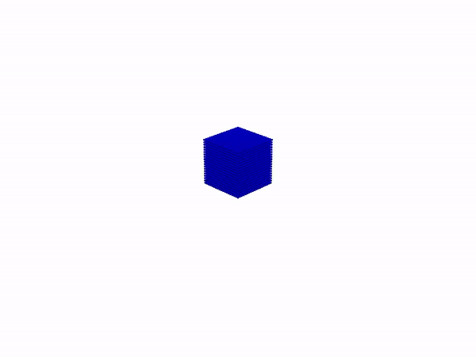

# Templating engine

The Inductiva API is all about enabling you to simulate at scale. As we have shown, with a few lines of Python code, you can send your simulations to MPI Clusters assembled from last-generation cloud hardware, letting you run much larger simulations than you would be able to using your local resources. Or you can spin up a large Machine Group, with dozens or hundreds of machines, and send a large number of simulations to be run on those machines in parallel. And such massive parallelism is precisely what you need when you are developing projects that require simulating a large number of variations of a certain base scenario. 

For example, suppose that for protecting a certain area on the coast, you are trying to find the best location and orientation for building a simple seawall, which can still have a number of possible variations. Suppose that you have 10 possible variations on the shape of the seawall, and you are considering 20 possible locations where you could build the wall. Also, you can direct the wall in 10 possible orientations. This design space includes a total of 2000 variations. For each configuration, you want to simulate the effectiveness of the wall under 25 different sea and wind conditions, which represent the extreme cases the wall is supposed to protect against. To completely explore the space of design and test it under all selected conditions, we would need to run 50000 simulations. 

This is quite a large number, and this is why Python scripting is great for this kind of challenge: you can build a set of “for loops'' that transverse all possible values for each parameter (shape, location, orientation, sea and wind conditions) and issue the corresponding simulation. Since the Inductiva API allows you to build large Machine Groups (e.g. 1000 machines) then you could potentially run 1000 of these variations in parallel and execute the 50000 simulations approximately in the time it would take to run 50 simulations in one machine (which we are going to assume it is a reasonable amount of time).

But, if each simulation is configured using a set of files, how do we programmatically change those simulation configuration files so that we can run 50000 *different* simulations, each one being a slight variation of the other. 

This is where Inductiva’s templating mechanism comes into play. Templating allows you to start with a specific simulation file – your “base case” – containing fixed values for the parameters you wish to explore and transform those fixed values into variables that you can now change programmatically from your Python code before you submit the simulation for remote execution. Let's illustrate the power of templating in a simple simulation case, from which you will be able to generalize to your own cases.

## A simple example: Experimenting fluids with different properties

Suppose you want to study how fluids with different properties fall inside a container with a cubic shape. More specifically, you want to study the effect of fluid density and kinematic viscosity in the splashing on the walls of the cubic container. For that, you wish to experiment with 4 values of fluid density and 4 values of kinematic viscosity. Overall, you will need to run 16 simulations. 

For the simulation of this scenario, you choose the SplishSplash simulator, and you
start by configuring your base case with a water fluid. The corresponding simulation files
are a `unit_box.obj` that defines the domain and the fluid block and the following
_json_ file (we designate by `config.json`):

```json
{
    "Configuration": {
        "stopAt": 1,
        "timeStepSize": 0.01,
        "particleRadius": 0.01,
        "simulationMethod": 4,
        "boundaryHandlingMethod": 0,
        "kernel": 1,
        "cflMethod": 1,
        "cflFactor": 0.5,
        "cflMinTimeStepSize": 0.0001,
        "cflMaxTimeStepSize": 0.005,
        "gravitation": [0, 0, -9.81],
        "gradKernel": 1,
        "enableVTKExport": true,
        "dataExportFPS": 60,
        "particleAttributes": "velocity;density"
    },
    "RigidBodies": [
        {
            "geometryFile": "unit_box.obj",
            "translation": [0, 0, 0],
            "scale": [1, 1, 1],
            "isDynamic": false
        }
    ],
    "Materials": [
        {
            "id": "Fluid",
            "density0": 1000,
            "viscosity": 1e-6,
            "viscosityMethod": 6
        }
    ],
    "FluidModels": [
        {
            "id": "Fluid",
            "particleFile": "unit_box.obj",
            "translation": [0, 0, 0],
            "scale": [0.5, 0.5, 0.5],
            "initialVelocity": [0, 0, 0]
        }
    ]
}
```

Using the API, one can run the simulation in a `c2-standard-30` VM with this code:

```python
import inductiva

# Download the input files mentioned above
input_dir = inductiva.utils.download_from_url(
    "https://storage.googleapis.com/inductiva-api-demo-files/"
    "splishsplash-dambreak-example.zip", unzip=True)

# Launch a machine group with a c2-standard-30
machine_group = inductiva.resources.MachineGroup(machine_type="c2-standard-30")
machine_group.start()

# Initialize the simulator and run the simulation
splishsplash = inductiva.simulators.SplishSplash()
task = splishsplash.run(
    input_dir=input_dir,
    sim_config_filename="config.json",
    on=machine_group)

# Wait for the simulation to finish and Download all generated output files
task.wait()
task.download_outputs()
```

This simulation takes about 26s to run and the final result looks like this
(visualization produced with `pyvista`):

<div align="center">
   
</div>


Observe that the in configuration file, the properties of the fluid (in this case water)
are specified in the following section:

```json
    "Materials": [
        {
            "id": "Fluid",
            "density0": 1000,
            "viscosity": 1e-6,
            "viscosityMethod": 6
        }
```

The first step in label the variables we want to iterate over. This is done by substituting
the values of the variables with a descriptive label inside double curly brackets. For the
density and viscosity, we can substitute the values with the labels `{{ density }}` and
`{{ kinematic_viscosity }}`, respectively. The resulting file will look like this:

    "Materials": [
        {
            "id": "Fluid",
            "density0": {{ density }},
            "viscosity": {{ kinematic_viscosity }},
            "viscosityMethod": 6
        }

We shall save this new file as `config.json.jinja`, and that’s it: we have a template. 
The labels we just assigned will now be treated as names of variables whose values
we can programmatically modify using Python. 

Saving our template file and the `unit_box.obj` file in a new folder named `splishsplash-template``
we can now run the same simulation with different properties we set programmatically.

This is how we would do it for the honey:

```python
import inductiva
from inductiva import mixins

# Launch a machine group with a c2-standard-30
machine_group = inductiva.resources.MachineGroup(machine_type="c2-standard-30")
machine_group.start()

# Download the input files mentioned above
input_dir = inductiva.utils.download_from_url(
    "https://storage.googleapis.com/inductiva-api-demo-files/"
    "splishsplash-template-example.zip", unzip=True)

# Set the honey properties at room temperature
honey_density = 1500 # kg/m^3
honey_kinematic_viscosity = 0.0075 # m^2/s

# Initialize the simulator and run the simulation
splishsplash = inductiva.simulators.SplishSplash()

# Initialize the templating engine
file_manager = mixins.FileManager()
file_manager.set_root_dir("splishsplash-honey")
file_manager.add_dir(input_dir,
                     density=honey_density,
                     kinematic_viscosity=honey_kinematic_viscosity)

task = splishsplash.run(
    input_dir=file_manager.get_root_dir(),
    sim_config_filename="config.json",
    on=machine_group)

# Wait for the simulation to finish and Download all generated output files
task.wait()
task.download_outputs()
```

In this case, we start from the template files just configured and start the templating engine
by creating a `FileManager` object. This object is responsible for managing the files and
directories that can be used in the simulation. In particular, it renders the configuration
files for the simulation from the template files and the programmatic values we set.
When templating, the `FileManager` removes the `.jinja` extension and keeps the file name.

The rendering is specifically done in the code line:
```python
file_manager.add_dir(input_dir, density=honey_density, kinematic_viscosity=honey_kinematic_viscosity)
```

The last step for generating the results we need for the study is to submit the 16
simulations from a single script by iterating over the set of admissible values for
both parameters. Additionally, we can save time by issuing these 16 simulations in
parallel. For that, we first need to create a machine group with 16 VMs:

```python
import inductiva
from inductiva import mixins

# Launch a machine group with a c2-standard-30
machine_group = inductiva.resources.MachineGroup(
    machine_type="c2-standard-4",
    num_machines=16)
machine_group.start()

# Download the input files mentioned above
input_dir = inductiva.utils.download_from_url(
    "https://storage.googleapis.com/inductiva-api-demo-files/"
    "splishsplash-template-example.zip", unzip=True)

# Initialize the simulator and run the simulation
splishsplash = inductiva.simulators.SplishSplash()

# Initialize the templating engine
file_manager = mixins.FileManager()
file_manager.set_root_dir("splishsplash-scenario")

# Set list of possible values for density and kinematic viscosity
density_list = [800, 1000, 1200, 1400, 1600]
kinematic_viscosity_list = [1e-3, 1e-4, 1e-5, 1e-6, 1e-7]

for density in density_list:
    for kinematic_viscosity in kinematic_viscosity_list:
        file_manager.add_dir(input_dir,
                             density=density,
                             kinematic_viscosity=kinematic_viscosity)

        task = splishsplash.run(
            input_dir=file_manager.get_root_dir(),
            sim_config_filename="config.json",
            on=machine_group)
```

For each possibility, an input folder is created with the base name `splishsplash-scenario` and
an iteration number, that serves to not override the previous folders.

Overall, the exploration of these 16 possibilities took 57s (the time of the slowest simulation), 
approximately the same time needed to run only one simulation. And this was all done
with minor changes to the simulation script that described the base case.
