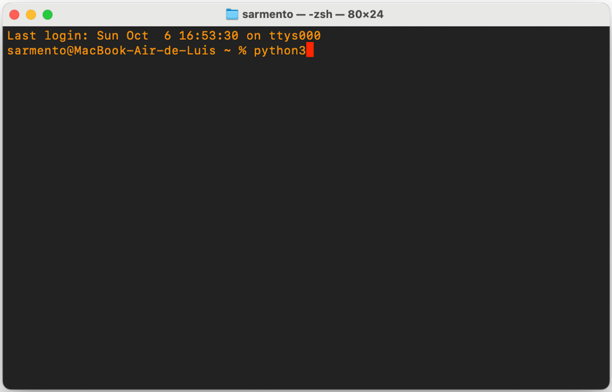

Installing the API on a clean OsX

Macbook Air 13  
M3  
OS: 14.5 (23F79) 

Before we continue, we need to make sure you have Python 3 properly installed. It may be the case that you have Python 3 installed in your system. If so, then we can proceed to installing the Python client for the Inductiva API as you would install any other Python package. If Python 3 is not installed, then we need to install it. Depending on the type and version of the operating system, installing Python may be substantially different. But first, let's check if Python is installed on your OSX.

# Stage 1: Checking if python is installed in OSX.

1) **Open a Terminal window.** For locating the Terminal app, let's use the Mac´s Search box, which can be opened by clicking on the magnifying glass icon on the right side of the top menu (close to the battery and wifi icons). Open the Search Box and type “Terminal”.  
     
    <div align="center">
        
    </div>
     
   This will allow you to open a Terminal.  
     
2) On the Terminal type: python3

<div align="center">
    
</div>  
It you have Python 3 installed you should seed something like:

<div align="center">
    
</div>

If so, you are good. You can go directly to Stage 2. Otherwise, you will probably see a long message like the one below:

<div align="center">
    
</div>

This is telling you that Python3 is not installed and if you want to do so you need to install Apple's Developer Tools, which among other tools includes the latest version of Python. 

Although there are other ways of installing Python on your Mac, we recommend installing the Developer Tools to ensure maximum consistency among all components that may be required for running Python properly. 

Observe that, behind your Terminal window, there is another window that is asking if you want to install the “command line developer tools”. You should answer “Install”. 

<div align="center">
    
</div>

Installing the Developer Tools may take a while (perhaps up to an hour depending on the speed of your Internet Connection) because it involves downloading quite a lot of software, including compilers and other development tools. Wait until you get the completion message.

c) **Testing Python3 Again**. Once everything is installed, then you can type python3 again on your terminal and should see something similar to Image X. You now have Python 3 installed, you can proceed to Stage 2.

# Stage 2: Updating PIP and setting PATH

Now that you have Python 3 installed, we need to be sure that some other minor dependencies are also met. There are two things we need to do:

1) update pip, the package installer for Python.   
2) make sure all Python binaries are visible from the command line

For updating pip, on the terminal type:

```console
python3 -m pip install --upgrade pip
```

This should run smoothly. However, check if you see warning messages such as:
```console
   WARNING: The scripts pip, pip3 and pip3.9 are installed in '/Users/YOURUSERNAME/Library/Python/3.9/bin' which is not on PATH.  
  Consider adding this directory to PATH or, if you prefer to suppress this warning, use --no-warn-script-location.
```
This is a sign that we still need to update the PATH environment variable to include the directory

/Users/YOURUSERNAME/Library/Python/3.9/bin

(Note: YOURUSERNAME is your actual username, which you should know or see from the terminal).   
This is required to let your system know where it can find some Python-related commands, such as pip. In fact, Inductiva’s own Command Line Interface will also be installed in the same location, so we need to make sure that this location is visible from the command line. 

To confirm that the PATH environment variable does not contain the directory mentioned above, on your Terminal type:

```console
echo $PATH
```

You should see something like this:  
<div align="center">
    
</div>

As expected, the required path  –  /Users/YOURUSERNAME/Library/Python/3.9/bin – is not there. So, let’s add it to your environment permanently. If you are using the zsh shell (the default OSX shell), then you can add the PATH information directly to the profile file ~/.zshrc. On  the terminal write 

```console
nano ~/.zshrc

and add the following line (adapting YOURUSERNAME to your actual username):  
   
export PATH=v$PATH:/Users/YOURUSERNAME/Library/Python/3.9/bin

Save the file. Now open a **different** terminal. On that terminal check the PATH environment variable again:

echo $PATH
````

You should now see the required directory added to the end of the PATH variable:

<div align="center">
    
</div>

Ok! We are good to go!  
By the way, we will need to edit the ~/.zshrc for installing the Inductiva API Key permanently. 

# Stage 3: Installing Inductiva Python Package

Now you can try:

```console
pip install inductiva
````

If all goes well, you should see a message such as:

```console
Successfully installed inductiva-0.9.0
```

If so, you should be able to just type on your Terminal:

```console
inductiva
```

and see an error message:

```console
ValueError: No API Key specified. Please set the INDUCTIVA_API_KEY environment variable.  
More infomation at:https://console.inductiva.ai/
```

This is expected! We now need to install the Inductiva API Key.

# Stage 4: Installing Inductiva API Key

The Inductiva Key is the information required by the API Client to authenticate against the Inductiva server and then be able to invoke operations, such as running simulations, on your behalf.

The best way to install your API Key is to add it as an environment variable. For that, you only need to append a line to your shell profile file ~/.zshrc. The specific line you have to add is available from the Inductiva Web console.  
Assuming you have already registered on the Console, go to (we will need to find a place for the key, I supposed needs to be in the user profile) Account and find the API Key widget:

<div align="center">
    
</div>

Open ~/.zshrc:

And copy the export statement above to the end of the  ~/.zshrc file. You should end up with something like this:

<div align="center">
    
</div>
Now, open another Terminal window/tab (it has to be a new one). Type:

```console
env
```

You should see your Inductiva API key variable at the end of the listing. If so, all is ready for running your first simulation.