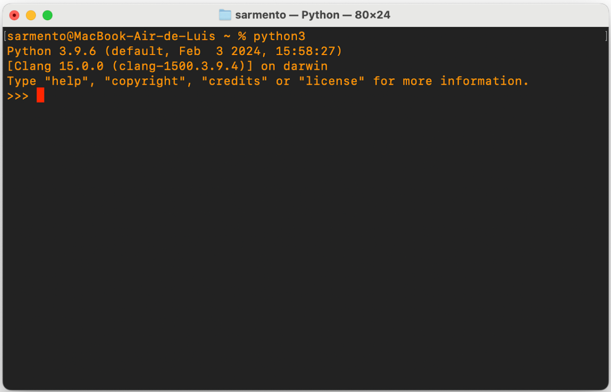

# System Requirements for Installing the Inductiva API


## TL;DR
Pre-Install Must-Dos:
- [Step 1: Check if Python is Installed](#step-1-check-if-python-is-installed)
- [Step 2: Update pip and Set Up Your PATH for Python](#step-2-update-pip-and-set-up-your-path-for-python)

## Introduction
Before diving into the installation process, it’s helpful to ensure your system is primed and ready for the Inductiva API.

We’ve gathered tips and feedback from users with different setups who’ve run into a few bumps while installing our API. The steps below are here to save you time and help you sidestep the most common setup challenges!

## Step 1: Check if Python is Installed

First things first, let’s make sure **Python 3** is set up correctly on your system. If you already have it installed, great! We’ll be able to move straight to installing the Inductiva API like any other Python package.
If it’s missing, we’ll go over how to install it depending on your operating system.

### Checking if Python is Installed on macOS

**Step-by-Step**

1. **Open the Terminal** 
	
    Click on the magnifying glass icon in the top-right of your menu bar (near the battery and Wi-Fi icons).

    Type “Terminal” and press Enter to open the Terminal app.
     
2. **Check for Python 3**
    
    In Terminal, type:
    ```bash
     python3
     ```

If Python 3 is installed, you’ll see something like this:

<div align="center">
    
</div>

If Python 3 isn’t installed, you’ll see a message suggesting installation of **Apple’s Developer Tools**.

<div align="center">
    
</div>

3. **Install Developer Tools**
  
    Behind your Terminal window, a prompt should appear asking if you want to install “command line developer tools.”

    Click **Install** to start.


<div align="center">
    
</div>

This installation can take a while (*up to an hour, depending on your internet speed*), as it includes necessary tools for running Python smoothly.

4. **Test Again**

    Once installation is complete, type `python3` in the Terminal again. You should now see confirmation that Python 3 is ready to go!

### Checking if Python is Installed on Windows

(Insert steps for WINDOWS HERE)

## Step 2: Update pip and Set Up Your PATH for Python

Now that you have **Python 3** installed, let’s make sure pip, the Python package installer, is up to date. This will help avoid any compatibility issues.

### Update pip and Set Up Your PATH for Python on macOS

#### Update pip

To update pip, open your Terminal and type:

```bash
python3 -m pip install --upgrade pip
```

This command should run smoothly, but if you see a warning message like this:

```bash
WARNING: The scripts pip, pip3, and pip3.9 are installed in '/Users/YOURUSERNAME/Library/Python/3.9/bin' which is not on PATH.
Consider adding this directory to PATH or, if you prefer to suppress this warning, use --no-warn-script-location.
```
it means we’ll need to update the **PATH environment variable** to make sure Python-related commands like pip are accessible from the command line.

#### Add Python to Your PATH

If you saw the warning above, it’s time to update your PATH variable. This tells your system where to find Python binaries, like pip, and ensures [Inductiva’s Command Line Interface](https://docs.inductiva.ai/en/latest/cli/cli-overview.html) can be accessed later on.

1. **Check Your Current PATH**

    In your Terminal, type:

```bash
echo $PATH
```

You should see something like this:  
<div align="center">
    
</div>

If you don’t see */Users/YOURUSERNAME/Library/Python/3.9/bin* in the output, it means this directory isn’t in your PATH yet.

````{eval-rst}
.. important::
   YOURUSERNAME is your actual username, which you can find by checking the Terminal prompt or running whoami in the Terminal!
````

2. **Add Python to PATH**

To permanently add Python’s location to PATH, let’s edit your profile file. If you’re using the default macOS shell (zsh), follow these steps:

First, Open the profile file in nano editor:

```bash
nano ~/.zshrc
```

Then, add the following line at the bottom of the file, replacing *YOURUSERNAME* with your actual username:

```bash
export PATH=$PATH:/Users/YOURUSERNAME/Library/Python/3.9/bin
```

Now, save the file by pressing CTRL + X, then Y to confirm, and Enter.

3. **Verify the Update**

Close the current Terminal and **open a new one**. Type:

```bash
echo $PATH
```
You should now see */Users/YOURUSERNAME/Library/Python/3.9/bin* included at the end of the PATH.

<div align="center">
    
</div>

### Update pip and Set Up Your PATH for Python on Windows

(Insert text here)

---

Awesome! Now that pip is updated and Python is set in your PATH, you’re all set for [installing the Inductiva Python Package](console.inductiva.ai) and start simulating!

If you run into any issues or challenges while installing the API, please reach out to us at support@inductiva.ai. We’d love to help troubleshoot and find ways to make the setup process even smoother.

You can also check out our [troubleshooting guide](../api_reference/troubleshooting.md) for more information.
