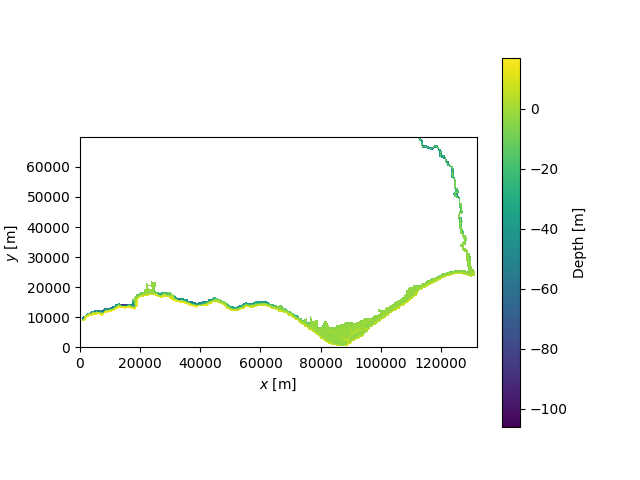
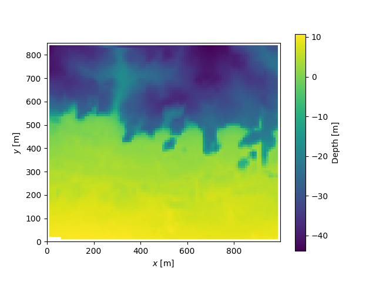
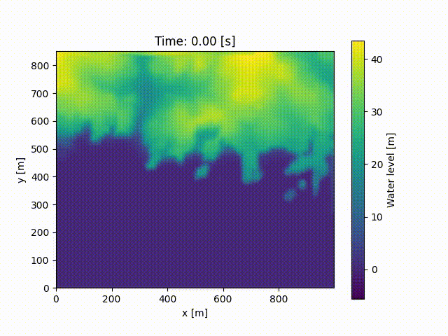

# Coastal area scenario

This scenario simulates waves propagating in a coastal area represented by a
bathymetric profile (i.e., the map of depths of the sea bottom as a function
of spatial coordinates x, y). Waves are injected into the domain from one of the
boundaries of the simulation with a given amplitude and period. The simulation
is performed using the [SWASH](https://swash.sourceforge.io/) simulator.

**Note:**  Some of the following tools require the installation of extra dependencies for the coastal package with
`pip install --upgrade "inductiva[coastal_extra]"`.

### Example

Note: You can follow this example in a notebook or run the script
`random_bathymetry_demo.py` available in this folder, that contains all the code
snippets exhibited here. Don't forget to insert your API key
(`inductiva.api_key = "your_api_key"`) for the script to work! (You can get one by
filling this [form](https://docs.google.com/forms/d/e/1FAIpQLSflytIIwzaBE_ZzoRloVm3uTo1OQCH6Cqhw3bhFVnC61s7Wmw/viewform?usp=sf_link))

The bathymetry that we use can be loaded from a real scenario or randomly generated
by us. To avoid having to download any data for now, we will start by run a simulation
on synthetic bathymetry, that is procedurally generated using the API.

We start by generating a random bathymetry.
```python
import inductiva

bathymetry = inductiva.coastal.Bathymetry.from_random_depths(
        x_range=(0, 100),
        y_range=(0, 100),
        x_num=100,
        y_num=100,
        max_depth=50)
```

This bathymetry is defined in a 50x50 grid, that represent a domain 100m
wide and 100m long. It can be inspected by plotting it.

```python
bathymetry.plot()
```


The bathymetry is ready to be used in a simulation scenario. In this case, we set
the wave source location to the west boundary of the domain (i.e. the lower x
boundary), with a wave amplitude of 5m and a wave period of 5.5 s:

```python
scenario = inductiva.coastal.CoastalArea(bathymetry=bathymetry,
                                         wave_source_location="W",
                                         wave_amplitude=5,
                                         wave_period=5.5,
                                         random_seed=12)
```

Once the scenario is created, run the simulation as follows:

```python
task = scenario.simulate(simulation_time=80, output_time_step=1)

output = task.get_output()
```

The user can specify the total simulation time and the time step between outputs
(all in seconds).

To visualize the results, we can generate and save a movie of the simulation. The
video will have n frames, where n is the ratio between simulation_time and
output_time_step.

```python
output.render(movie_path = "movie_path.mp4")
```


### Example with a real bathymetry

Now let's perform our simulations with real data!

Start by loading a bathymetry. This can be done e.g. by reading an
[ASCII XYZ file](https://emodnet.ec.europa.eu/sites/emodnet.ec.europa.eu/files/public/20171127_DTM_exchange_format_specification_v1.6.pdf),
a standard format for bathymetry data (for examples, see e.g. the [European Marine Observation and Data Network](https://emodnet.ec.europa.eu/geoviewer/#!/)).
Here we shall use the bathymetry data from Algarve.

```python
import inductiva

bathymetry_url = "https://downloads.emodnet-bathymetry.eu/high_resolution/590_HR_Lidar_Algarve.emo.zip"

bathymetry_path = inductiva.utils.files.download_from_url(bathymetry_url)

bathymetry = inductiva.coastal.Bathymetry.from_ascii_xyz_file(
    ascii_xyz_file_path = bathymetry_path)
```

The bathymetry can be inspected by plotting it with a given resolution, in this
case 200m x 200m:

```python
bathymetry.plot(x_resolution=200, y_resolution=200)
```



Raw bathymetry data will often span an area too large and sparsely sampled to
be used in a simulation. In this case, the user can crop the bathymetry to a
smaller area of interest:

```python
bathymetry = bathymetry.crop(x_range=(51000, 52000), y_range=(12150, 13000))
bathymetry.plot()
```



To be used in a simulation, the bathymetry data must be interpolated to a
regular grid with custom resolution, in this case 5m x 5m. In case some
positions are missing in the bathymetry data (see e.g. the lower left corner in
the figure above), the user can choose to fill them with a constant depth or the
nearest depth value:

```python
bathymetry = bathymetry.to_uniform_grid(x_resolution=5,
                                        y_resolution=5,
                                        fill_value="nearest")
```

When interpolated to a regular grid, the bathymetry is ready to be used in a
simulation scenario. In this case, we set the wave source location to the south
boundary of the domain (i.e. the lower y boundary), with a wave amplitude of 5m
and a wave period of 5.5s:

```python
scenario = inductiva.coastal.CoastalArea(bathymetry=bathymetry,
                                         wave_source_location="S",
                                         wave_amplitude=5,
                                         wave_period=5.5)
```

In case the bathymetry is not defined on a regular grid when creating a
scenario, interpolation to a regular grid is automatically attempted with a
default resolution of 2m x 2m and no pre-configured strategy to fill depths at
positions missing in the bathymetry.

Once the scenario is created, run the simulation as follows:

```python
task = scenario.simulate(simulation_time=100, output_time_step=1)

output = task.get_output()
```

The user can specify the total simulation time and the time step between outputs
(all in seconds).

To visualize the results:

```python
output.render()
```


