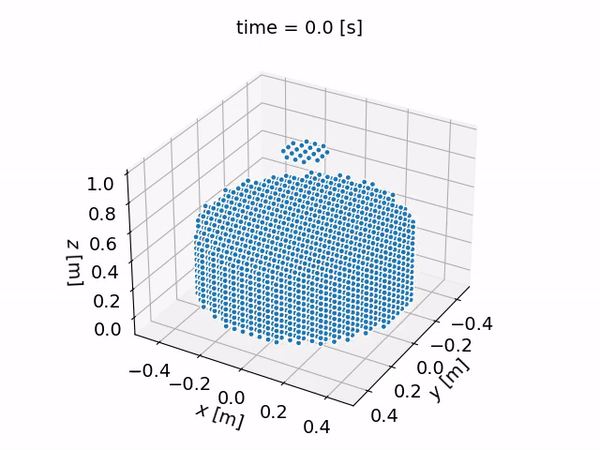

# Fluid Tank Scenario

The Fluid Tank Scenario simulates the motion of a single fluid in a cubic or cylindrical tank.
Fluid is injected into the tank via an inlet located at the top of the tank and
flows out of the tank via an outlet located at the bottom of the tank. The position,
shape and size of both the inlet and the outlet can be defined by the user. The
motion of the fluid is controlled by gravity. The simulation is performed using
the [Smoothed Particle Hydrodynamics](https://en.wikipedia.org/wiki/Smoothed-particle_hydrodynamics)
method.

### Example

The SPH engines available for running this scenario are DualSPHysics and SplishSplash.

Albeit this is a quite simple simulation scenario, the Fluid Tank Scenario illustrates the
SPH capabilities of the API. If you would like to use other more complex SPH scenarios,
please let us know via simulations@inductiva.ai.

We provide the following example to demonstrate the Fluid Tank Scenario. Do not forget to insert
your API Key (check the [main page](https://github.com/inductiva/inductiva/tree/main#api-access-tokens) to see how get one).

```python
import inductiva

scenario = inductiva.fluids.FluidTank(
    shape=inductiva.fluids.shapes.Cylinder((radius=0.5, height=1)),
    fluid=inductiva.fluids.WATER,
    fluid_level=0.5,
    inlet=inductiva.fluids.CircularTankInlet(radius=0.5),
    outlet=inductiva.fluids.CylindricalTankOutlet())

task = scenario.simulate(simulation_time=5,
                           output_time_step=0.1,
                           resolution="medium")

output = task.get_output()

output.render()
```

The initialization of the scenario requires the:
- `shape`: The shape of the tank. It supports both `Cylinder` and `Cube`shapes.
For the cylinder the radius and height can be specified, whilst the cube only
 requires the edge length;
- `fluid`: The fluid being simulated. Supports WATER, OLIVE_OIL, LIQUID_PROPANE,
JET_FUEL, GEAR_OIL, BEER and HONEY. Different fluid types have different physical
properties, namely the density and kinematic viscosity;
- `fluid level`: The fluid level initially in the tank;
- `inlet`: Circular inlet whose radius is configurable;
- `outlet`: Outlet shape. Supported shapes are CylindricalTankOutlet and 
CubicTankOutlet. Cylindrical requires radius and height. Cubic only requires the
edge length.

The user can specify the total simulation time and the time step between outputs
(all in seconds). The user can also specify the resolution of the simulation
(low, medium or high). Different resolutions will yield different sized particles
in the visualizations of the fluid behaviour. 

To visualize the results, users will need to install the extra dependencies of the fluid package with `pip install --upgrade "inductiva[fluids_extra]"`. 
Then run the following code:

```python
output.render()
```

