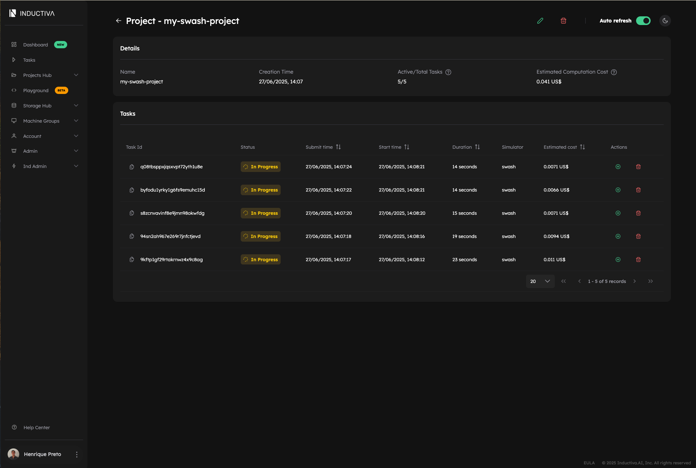

# Scale Up and Organize Simulation Batches with Projects and Metadata

In this tutorial, you'll learn how to run multiple simulations in parallel — each with
its own input directory — and manage them efficiently using Inductiva's cloud platform.
You'll learn how to submit multiple simulations efficiently to the cloud, organize them
using projects and metadata, monitor the simulations progress using the
[Console](https://console.inductiva.ai/dashboard) and later download the results in a
clean and automated way using the Inductiva API.

## What You Will Learn

- Submit **multiple** simulations in parallel
- Use **vertical scaling** (more powerful machine) and **horizontal scaling** (more machines)
- Group your simulations in a **project**
- Add **metadata** to track and distinguish each simulation
- Monitor the tasks using the [Console](https://console.inductiva.ai/dashboard)
- Download outputs programmatically

## Input Folder Structure

We assume the following layout:

```
swash-inputs/
├── swash-input-1/
│   └── S1.sws
|   └── ...
├── swash-input-2/
│   └── S1.sws
|   └── ...
├── ...
```

Each subfolder contains all the input files for a **SWASH** simulation.
All simulations use the same config file, named `S1.sws`.

## Submitting Simulations in Parallel

Here's the full Python script to submit all your simulations at once:

```python
import inductiva
import pathlib

# Define Cloud Resources
cloud_machine = inductiva.resources.MachineGroup(
    machine_type="c3d-highcpu-180",  # Vertical scaling: CPU-heavy machine
    num_machines=5,                  # Horizontal scaling: up to 5 simulations in parallel
    spot=True,                       # Use cheaper spot instances (can be interrupted)
)

# Initialize Simulator and Project Settings
swash = inductiva.simulators.SWASH(version="11.01") # Initialize SWASH simulator
sim_config_filename = "S1.sws"                      # Common simulation configuration file name
project_name = "my-swash-project"                   # Group tasks under this project

# Collect Input Folders
root_path = pathlib.Path("swash-inputs")
input_dirs = [
    input_dir for input_dir in root_path.iterdir()
    if input_dir.is_dir()
]

# Submit Tasks in Parallel (No Waiting)
for input_dir in input_dirs:
    task = swash.run(
        input_dir=input_dir,
        sim_config_filename=sim_config_filename,
        on=cloud_machine,
        project=project_name,
    )

    # Attach metadata - e.g., to later identify the source input
    task.set_metadata({
        "input_dir": input_dir.name,
    })
```

### Notes on the Script

- Spot Instances: Setting `spot=True` uses cheaper machines that may be interrupted at any time.
More info [here](https://cloud.google.com/compute/docs/instances/spot).

- No `task.wait()` Calls: The script doesn't call `task.wait()` inside the for loop — that's intentional.
This allows all simulations to be submitted immediately without waiting for each other to complete.
This approach submits all tasks as quickly as possible, maximizing parallelism and taking full advantage
of Inductiva API.

- Automatic Shutdown: The machine group will terminate automatically after 5 minutes of inactivity.
You can customize this using `max_idle_time` parameter in the [`MachineGroup` constructor](https://inductiva.ai/guides/documentation/api/inductiva.resources#inductiva.resources.machine_groups.MachineGroup).

## Monitor Your Simulations

As soon as the script runs, your simulations begin running in parallel across cloud machines.
You can monitor their progress directly through the [Inductiva Console](https://console.inductiva.ai/dashboard).

### View Tasks in the Console

1. Navigate to the [Projects](https://console.inductiva.ai/projects/projects) tab.
2. Click on your project name — in this case: `my-swash-project`.
3. You'll see a list of all tasks submitted under that project, along with their current statuses (e.g., `In progress`).



4. Click on any task to open a detailed view.


## Downloading Outputs

Once your simulations finish, download all outputs with the following script:

```python
import inductiva
import os

project = inductiva.projects.Project("my-swash-project")

for task in project.get_tasks():
    metadata = task.get_metadata()
    input_dir = metadata["input_dir"]
    task.download_outputs(output_dir=os.path.join("swash-outputs", input_dir))
```

You'll get logs like this:

```bash
Downloading simulation files to swash-outputs/swash-input-1/output.zip...
100%|███████████████████████████████████████████████████████████████████████████| 57.3M/57.3M [00:00<00:00, 73.6MB/s]
Uncompressing the files to swash-outputs/swash-input-1...
...
```

Now, your outputs are organized cleanly by input directory:

```bash
swash-outputs/
├── swash-input-1/
├── swash-input-2/
├── ...
```

---

# Wrapping Up: A Scalable Simulation Workflow


In this tutorial, you learned how to efficiently run multiple SWASH simulations in parallel using the Inductiva API.

By leveraging cloud resources, projects, and task metadata, you've created a scalable and maintainable workflow for large
batches of simulations.

### Key Takeaways

- **Parallel execution** drastically reduces total runtime.
- **Projects** help group and manage related simulations.
- **Metadata** enables tracking and post-processing of individual runs.
- **The Console** provides a clear UI for progress monitoring, task management and troubleshooting.
- **Programmatic downloads** keep your results organized and reproducible.

Whether you're scaling vertically with more powerful machines or horizontally by running many tasks at once, Inductiva makes
it easy to run cloud simulations at scale.

You're now ready to integrate this workflow into larger pipelines, automate experiment batches, or build research tools powered
by Inductiva's infrastructure.

**Happy simulating!**
