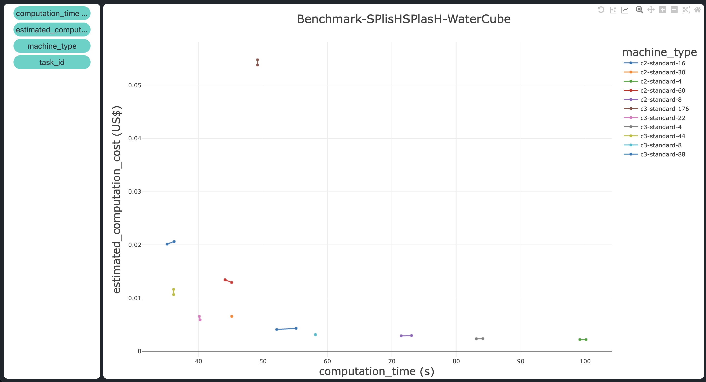

---
myst:
  html_meta:
    description: "This tutorial provides a step-by-step guide for benchmarking the synthetic data 
    generation simulation using the Inductiva API. Learn how to configure and run benchmarks on various 
    machine types from Google Cloud, analyze results, and visualize performance metrics for different 
    computational setups."
    keywords: "Inductiva API, Benchmarking, Performance, Metrics, Computation Time, Computation Cost,
    Programming, HPC, Simulation, Tutorial, Synthetic Data Generation, Physics-ML, SPH"
---

# Benchmark Computational Resources

In the previous step of this tutorial, we used Inductiva’s templating mechanism to 
transform the configuration files for our base case simulation into a generalized 
file, allowing programmatic changes to key parameters. These parameters included 
dimensions, initial position and velocity of the fluid block, as well as the density 
and viscosity of the fluid itself, essential elements that define the core physical 
properties of the simulation. 

Additionally, we generalized certain hyperparameters, such as the ***particle radius***, 
which influence the simulation’s fidelity and performance.

So, besides the need to assess the impact of the hyperparameters in the 
computational cost of the simulation, we will also need to see if we can 
optimize the machine type. When selecting the right machine types for 
computational tasks, balancing speed and cost is crucial. In this step, 
we explore the performance and cost-efficiency of various machine types, 
focusing on how computation time scales with the number of virtual CPUs (vCPUs).

## 1. Download the Input Files (```download.py```)

First, we need to download the necessary input files. This step is needed because the benchmark requires specific data to 
simulate the **WaterCube** environment. The code snippet uses the ```download_from_url``` method to download and unzip the 
required files directly into your local directory. You can skip this step if you already have the input files in your local 
directory.

```python
import inductiva

inductiva.utils.files.download_from_url(
    url="https://tutorials.inductiva.ai/_static/generating-synthetic-data/"
        "splishsplash-base-dir.zip",
    unzip=True)
```

## 2. Upload the input files to reuse them across multiple benchmark runs and avoid repeated input uploads (```upload.py``)

```python
import inductiva

inductiva.storage.upload(local_path="splishsplash-base-dir",
                         remote_dir="splishsplash-input-dir")
```

## 3. Configure and run the benchmark named ```Benchmark-SPlisHSPlasH-WaterCube``` across multiple machine groups from the ```c3``` and ```c2``` families, with varying numbers of vCPUs, and repeat each run twice (```run.py```)

```python
import datetime
from inductiva import benchmarks, simulators, resources

benchmark = benchmarks.Benchmark(name="Benchmark-SPlisHSPlasH-WaterCube") \
    .set_default(simulator=simulators.SplishSplash(),
                 sim_config_filename="config.json",
                 remote_assets=["splishsplash-input-dir"])

machine_types = [
    "c2-standard-4", "c2-standard-8", "c2-standard-16", "c2-standard-30",
    "c2-standard-60", "c3-standard-4", "c3-standard-8", "c3-standard-22",
    "c3-standard-44", "c3-standard-88", "c3-standard-176",
]
num_repeats = 2
max_idle_time = datetime.timedelta(seconds=30)

for machine_type in machine_types:
    benchmark.add_run(on=resources.MachineGroup(machine_type=machine_type,
                                                num_machines=num_repeats,
                                                max_idle_time=max_idle_time))

benchmark.run(num_repeats=num_repeats)
```

## 4. Export the benchmark data and metrics to a CSV file named ```Benchmark-SPlisHSPlasH-WaterCube.csv``` after ensuring all tasks have completed and all resources used for the benchmark have been terminated (```export.py```)

```python
from inductiva import benchmarks

benchmarks.Benchmark(name="Benchmark-SPlisHSPlasH-WaterCube") \
    .wait() \
    .terminate() \
    .export(fmt="csv")
```

## 5. Visualize the benchmark results:

### 5.1. Markdown table: I used [this](https://tableconvert.com/csv-to-markdown) online tool to convert the CSV file into a Markdown table format.

```
| machine_type    | estimated_computation_cost (US$) | computation_time (s) | task_id                   |
|-----------------|----------------------------------|----------------------|---------------------------|
| c3-standard-176 | 0.053812210494                   | 49.174               | 0bgkh9xx16eui51ijxtb6ux86 |
| c3-standard-176 | 0.054790614321                   | 49.181               | n61gv7tfkci6e80jjiqvodsdv |
| c2-standard-60  | 0.013439589506                   | 44.144               | 0h701znoed7tfiv2wh0v6ydw6 |
| c2-standard-60  | 0.012932435185                   | 45.159               | n5upfe2n35wtk1qe48pzjh7ez |
| c3-standard-88  | 0.020144276914                   | 35.139               | 469k83ppb37zi8xjadqejz2cg |
| c3-standard-88  | 0.020635600741                   | 36.233               | mconyhtckc0rs6cc3jjnkoyh0 |
| c3-standard-22  | 0.006552719013                   | 40.148               | ed08ydiknndtdkv7s3nh4sp4t |
| c3-standard-22  | 0.005922649877                   | 40.248               | 0422m5s30n0uxmiyy00bg3uo1 |
| c3-standard-8   | 0.003105524938                   | 58.183               | qu0kf1cqpwc85yye8su34ond2 |
| c3-standard-8   | 0.003154048766                   | 58.175               | cea52xxuj1tvxhwu1ruw7c0nv |
| c3-standard-4   | 0.002348160618                   | 83.18                | r47bemyjyjzy4x0fhxeqm33bj |
| c3-standard-4   | 0.002374544445                   | 84.182               | 91aoeet96m3di0wa429u1k4s3 |
| c3-standard-44  | 0.011645839877                   | 36.152               | t8ajechar6rhstg1j71wpa0j9 |
| c3-standard-44  | 0.010654704568                   | 36.155               | irxjh6wxcus044e15uhhy1ww7 |
| c2-standard-8   | 0.002924085185                   | 71.496               | 8kb27eno9qajnpyx5pnubqzat |
| c2-standard-4   | 0.002211801235                   | 100.209              | ts13hykwxhgoamgczndsiyy96 |
| c2-standard-30  | 0.006574435185                   | 45.174               | 2sceirkj0dm1ye2v923ri5ziq |
| c2-standard-8   | 0.002961573457                   | 73.101               | 89aomezvc6mznu2q89u84vjan |
| c2-standard-30  | 0.006574435185                   | 45.172               | 4xau4bu9ikogmycqtwmv2ybdo |
| c2-standard-4   | 0.002211801235                   | 99.237               | 6a12iau416t567v15swn7ir78 |
| c2-standard-16  | 0.004102497531                   | 52.169               | tv7cy85r83u0sofgir5m8t8i3 |
| c2-standard-16  | 0.004314695679                   | 55.172               | c6f0bbbcdpcb88eorsyvwvms2 |
```

### 5.2 Plot graph: I used [this](https://www.csvplot.com/) online tool to plot the benchmark results from the CSV file on a graph.



#### 5.3 Analysis:

- The best machine types in terms of computation cost and computation time are ```c3-standard-44``` and ```c3-standard-22```, with the latter being slightly slower but more cost-effective -- positioned in the leftmost bottom corner of the plot. They take 35 and 40 seconds, respectively, and cost $0.01 and $0.005 each.

- The speedup in terms of execution time levels off at 44 vCPUs. The ```c3-standard-88``` takes the same computation time as the ```c3-standard-44``` (around 36 seconds) but costs twice as much ($0.02 compared to $0.01, respectively). An even clearer indication of this plateau in speedup is that the most powerful machine, the ```c3-standard-176```, is actually slower than an older-generation machine with far fewer vCPUs, the ```c2-standard-30``` (around 49 seconds vs. 45 seconds, respectively). Moreover, it costs 10 times more ($0.06 vs. $0.006).

- The computation time starts to increase more rapidly when the number of vCPUs is reduced below 16 (from 50 seconds to 100 seconds), while the cost remains relatively constant at around $0.002.