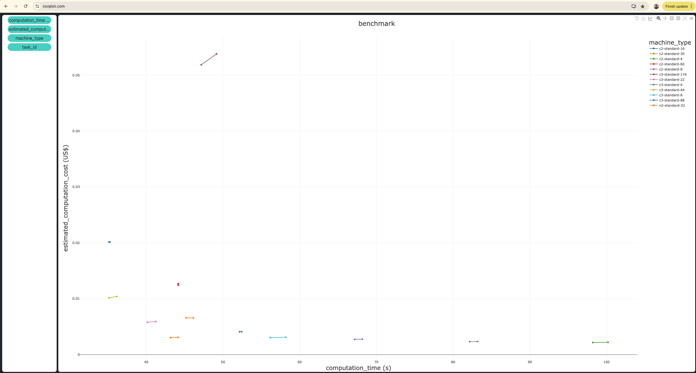

# Use Case:

The user wants to benchmark the **SplishSplash** simulator across different machine types available on GCP. The simulation is explained [here](https://tutorials.inductiva.ai/generating-synthetic-data/synthetic-data-generation-1.html#learning-complex-physics-a-practical-study). Specifically, the user plans to benchmark the ```c2-standard``` and ```c3-standard``` machine families with varying numbers of vCPUs. Later, the user decides to explore whether there's a significant performance difference with other machine types, such as ```n2-standard-32```. The goal is to identify the best machine, balancing the trade-off between computation time and cost. After completing the benchmark, the user intends to visualize the results to select the most optimal machine based on this trade-off.

# Steps:

## Step 1: Download the files (```download.py```)

```python3
import inductiva

inductiva.utils.download_from_url(
    url="https://tutorials.inductiva.ai/_static/generating-synthetic-data/splishsplash-base-dir.zip",
    unzip=True)
```

## Step 2: Configure and run the benchmark (```run.py```)

#### Implementation 1:

- When initializing a benchmark, assign a name to the benchmark (e.g., ```splishsplash-fluid-cube```).
- Add new runs by calling ```add_run```.
- Execute the benchmark by calling ```run```, repeating each added run twice (i.e., ```num_repeats=2```).

```python
from inductiva import benchmarks, simulators, resources

benchmarks.Benchmark(name="splishsplash-fluid-cube") \
    .add_run(simulator=simulators.SplishSplash(),
             input_dir="splishsplash-base-dir",
             sim_config_filename="config.json",
             on=resources.MachineGroup("c2-standard-4")) \
    .add_run(simulator=simulators.SplishSplash(),
             input_dir="splishsplash-base-dir",             
             sim_config_filename="config.json",
             on=resources.MachineGroup("c2-standard-8")) \
    .add_run(simulator=simulators.SplishSplash(),
             input_dir="splishsplash-base-dir",             
             sim_config_filename="config.json",
             on=resources.MachineGroup("c2-standard-16")) \
    .add_run(simulator=simulators.SplishSplash(),
             input_dir="splishsplash-base-dir",
             sim_config_filename="config.json",
             on=resources.MachineGroup("c2-standard-30")) \
    .add_run(simulator=simulators.SplishSplash(),
             input_dir="splishsplash-base-dir",
             sim_config_filename="config.json",
             on=resources.MachineGroup("c2-standard-60")) \
    .add_run(simulator=simulators.SplishSplash(),
             input_dir="splishsplash-base-dir",
             sim_config_filename="config.json",
             on=resources.MachineGroup("c3-standard-4")) \
    .add_run(simulator=simulators.SplishSplash(),
             input_dir="splishsplash-base-dir",
             sim_config_filename="config.json",
             on=resources.MachineGroup("c3-standard-8")) \
    .add_run(simulator=simulators.SplishSplash(),
             input_dir="splishsplash-base-dir",
             sim_config_filename="config.json",
             on=resources.MachineGroup("c3-standard-22")) \
    .add_run(simulator=simulators.SplishSplash(),
             input_dir="splishsplash-base-dir",
             sim_config_filename="config.json",
             on=resources.MachineGroup("c3-standard-44")) \
    .add_run(simulator=simulators.SplishSplash(),
             input_dir="splishsplash-base-dir",
             sim_config_filename="config.json",
             on=resources.MachineGroup("c3-standard-88")) \
    .add_run(simulator=simulators.SplishSplash(),
             input_dir="splishsplash-base-dir",
             sim_config_filename="config.json",
             on=resources.MachineGroup("c3-standard-176")) \
    .run(num_repeats=2)
```

### Enhance the **readability** of the benchmark program

#### Implementation 2:

- Reduce lines of code, improve readability, and avoid code duplication by calling ```set_default```.

```python
from inductiva import benchmarks, simulators, resources

benchmarks.Benchmark(name="splishsplash-fluid-cube") \
    .set_default(simulator=simulators.SplishSplash(),
                 input_dir="splishsplash-base-dir",
                 sim_config_filename="config.json") \
    .add_run(on=resources.MachineGroup("c2-standard-4")) \
    .add_run(on=resources.MachineGroup("c2-standard-8")) \
    .add_run(on=resources.MachineGroup("c2-standard-16")) \
    .add_run(on=resources.MachineGroup("c2-standard-30")) \
    .add_run(on=resources.MachineGroup("c2-standard-60")) \
    .add_run(on=resources.MachineGroup("c3-standard-4")) \
    .add_run(on=resources.MachineGroup("c3-standard-8")) \
    .add_run(on=resources.MachineGroup("c3-standard-22")) \
    .add_run(on=resources.MachineGroup("c3-standard-44")) \
    .add_run(on=resources.MachineGroup("c3-standard-88")) \
    .add_run(on=resources.MachineGroup("c3-standard-176")) \
    .run(num_repeats=2)
```

#### Implementation 3:

- Create a list of machine types, then use a ```for``` loop to initialize the machine groups and add the new runs to the benchmark.

```python
from inductiva import benchmarks, simulators, resources

benchmark = benchmarks.Benchmark(name="splishsplash-fluid-cube") \
    .set_default(simulator=simulators.SplishSplash(),
                 input_dir="splishsplash-base-dir",
                 sim_config_filename="config.json")

machine_types = ["c2-standard-4", "c2-standard-8", "c2-standard-16",
                 "c2-standard-30", "c2-standard-60", "c3-standard-4",
                 "c3-standard-8", "c3-standard-22", "c3-standard-44",
                 "c3-standard-88", "c3-standard-176"]

for machine_type in machine_types:
    benchmark.add_run(on=resources.MachineGroup(machine_type))

benchmark.run(num_repeats=2)
```

### Optimize the benchmark program to minimize computation time and cost

#### Implementation 4:

- Avoid uploading the input files to each run by uploading them only once using the ```remote_assets``` parameter. This way, the input files are stored in a GCP bucket and reused on every simulation added to the benchmark.
- Begin by uploading the input files to a GCP bucket.

```python
import inductiva

inductiva.storage.upload(local_path="splishsplash-base-dir",
                         remote_dir="splishsplash-input-dir")
```

- Next, reuse the uploaded files on each run by passing the ```remote_assets``` argument to the ```set_default``` method.
- Remove the ```input_dir``` parameter from the ```set_default``` method.

```python
from inductiva import benchmarks, simulators, resources

benchmark = benchmarks.Benchmark(name="splishsplash-fluid-cube") \
    .set_default(simulator=simulators.SplishSplash(),
                 sim_config_filename="config.json",
                 remote_assets=["splishsplash-input-dir"])

machine_types = ["c2-standard-4", "c2-standard-8", "c2-standard-16",
                 "c2-standard-30", "c2-standard-60", "c3-standard-4",
                 "c3-standard-8", "c3-standard-22", "c3-standard-44",
                 "c3-standard-88", "c3-standard-176"]

for machine_type in machine_types:
    benchmark.add_run(on=resources.MachineGroup(machine_type))

benchmark.run(num_repeats=2)
```

#### Implementation 5:

- Speed up the benchmark execution by parallelizing the repetitions on each machine.
- For each machine group, set the number of machines to the number of repetitions (i.e., ```num_machines=num_repeats```)
- The repetitions of the simulations on each machine group will then run in parallel.

```python
from inductiva import benchmarks, simulators, resources

benchmark = benchmarks.Benchmark(name="splishsplash-fluid-cube") \
    .set_default(simulator=simulators.SplishSplash(),
                 sim_config_filename="config.json",
                 remote_assets=["splishsplash-input-dir"])

machine_types = ["c2-standard-4", "c2-standard-8", "c2-standard-16",
                 "c2-standard-30", "c2-standard-60", "c3-standard-4",
                 "c3-standard-8", "c3-standard-22", "c3-standard-44",
                 "c3-standard-88", "c3-standard-176"]

num_repeats = 2

for machine_type in machine_types:
    benchmark.add_run(on=resources.MachineGroup(machine_type=machine_type,
                                                num_machines=num_repeats))

benchmark.run(num_repeats=num_repeats)
```

#### Implementation 6:

- Reduce the maximum idle time of each resource to avoid wasting computational resources and, as a result, decrease the benchmark cost (i.e., ```max_idle_time = datetime.timedelta(seconds=30)```).
- Be aware that decreasing the maximum idle time may cause an error if there isn't enough time to submit the simulations.

```python
import datetime
from inductiva import benchmarks, simulators, resources

benchmark = benchmarks.Benchmark(name="splishsplash-fluid-cube") \
    .set_default(simulator=simulators.SplishSplash(),
                 sim_config_filename="config.json",
                 remote_assets=["splishsplash-input-dir"])

machine_types = ["c2-standard-4", "c2-standard-8", "c2-standard-16",
                 "c2-standard-30", "c2-standard-60", "c3-standard-4",
                 "c3-standard-8", "c3-standard-22", "c3-standard-44",
                 "c3-standard-88", "c3-standard-176"]

num_repeats = 2

max_idle_time = datetime.timedelta(seconds=30)

for machine_type in machine_types:
    benchmark.add_run(on=resources.MachineGroup(machine_type=machine_type,
                                                num_machines=num_repeats,
                                                max_idle_time=max_idle_time))

benchmark.run(num_repeats=num_repeats)
```

### Add another GCP instance to the benchmark for comparison with the previously added instances

#### Implementation 7:

- The user can add new runs later if desired.
- Recreate the benchmark using the same name (i.e., ```splishsplash-fluid-cube```).
- Add a new run execution for the ```n2-standard-32``` machine type (i.e., ```machine_type="n2-standard-32"```) and execute only this run twice.

```python
import datetime
from inductiva import benchmarks, simulators, resources

num_repeats = 2

max_idle_time = datetime.timedelta(seconds=30)

benchmark = benchmarks.Benchmark(name="splishsplash-fluid-cube") \
    .add_run(simulator=simulators.SplishSplash(),
             sim_config_filename="config.json",
             remote_assets=["splishsplash-input-dir"],
             on=resources.MachineGroup(machine_type="n2-standard-32",
                                       num_machines=num_repeats,
                                       max_idle_time=max_idle_time)) \
    .run(num_repeats=num_repeats)
```

## Step 3: Export the benchmark data to a file (```export.py```)

- Export the metrics for the benchmark called ```"splishsplash-fluid-cube"``` into a CSV file named ```"benchmark.csv"```, filtering for only the successful tasks (```status="success"```) and selecting only the attributes and metrics that vary with each run (```select="distinct"```).
- To ensure that all benchmark-related tasks are completed and all resources used during the benchmark are terminated, call ```wait()``` and ```terminate()```, in that order.

```python
from inductiva import benchmarks

benchmarks.Benchmark(name="splishsplash-fluid-cube") \
    .wait() \
    .terminate() \
    .export(fmt="csv",
            status="success",
            select="distinct",
            filename="benchmark.csv")
```

## Step 4: Choose a visualization tool to analyze the benchmark results

- Open [CSVPlot](https://www.csvplot.com/) and upload the exported CSV file containing the benchmark data.



- The best machine in terms of both computation time and cost is the ```c3-standard-44```, located at the bottom-left of the plot. This machine takes around 35 seconds and costs about $0.01, while the second-fastest machine, ```c3-standard-88```, takes the same amount of time but costs twice as much.