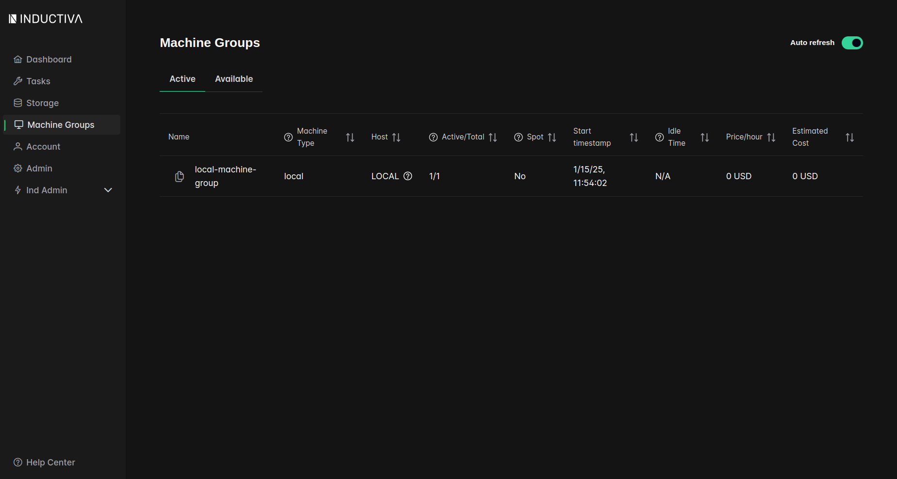
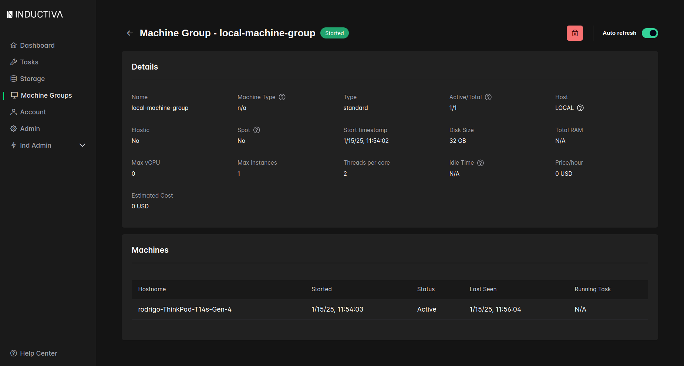

# Use the Local Task-Runner

The local task-runner allows you to execute simulations on your own computer. This feature is particularly useful for testing and running simulations at minimal cost, as you only pay for storage while utilizing your local computational resources for free. The storage costs come from saving the simulation inputs and results in the cloud for future access.

In this tutorial, we’ll guide you through setting up and using the local task-runner to execute simulations. By the end of this tutorial, you’ll know how to configure, launch, and run simulations locally with ease.

## What You’ll Learn

In this tutorial, you’ll learn to:

- Launch the local task-runner using Docker.
- Add your computer to a machine group.
- Configure and execute simulations using the local task-runner.
- Monitor and manage local resources.

Let’s get started!

## Prerequisites

Before proceeding, ensure you have the following installed on your computer:

- [Docker](https://www.docker.com/)  
- Inductiva Python package (`pip install inductiva`)
- Inductiva Python package with Task-Runner support (`pip install inductiva[task-runner]`)

## Step 1: Launch the Local Task-Runner

To start the local task-runner, use the `inductiva task-runner launch` command. This launches a Docker container running the task-runner and registers your computer as part of a machine group.

```bash
$ inductiva task-runner launch <machine-group-name>
```

### List and Inspect Resources
After launching the task-runner, use the following commands to view and inspect your machine group:

List resources:

```bash
$ inductiva resources list

 NAME                  MACHINE TYPE     ELASTIC     TYPE       # MACHINES     DATA SIZE IN GB     SPOT     STARTED AT (UTC)     IDLE TIME     MAX COST ($/HOUR)
 local-machine-group   local            False       standard   1/1            32                  False    15/01, 11:54:02      0:00:19       0

```

Or using the web-console:



Get resource details:
```bash
$ inductiva resources info <machine-group-name>

Showing machines of machine group: local-machine-group

 HOST NAME                     STARTED           STATUS     LAST SEEN         RUNNING TASK
 rodrigo-ThinkPad-T14s-Gen-4   15/01, 11:54:03   Active     15/01, 11:54:33   n/a
    
```

In the web-console:



### Customize the Hostname
You can customize the hostname using the --hostname argument:

```bash
$ inductiva task-runner launch <machine-group-name> --hostname <custom-hostname>
```
If you don’t specify a hostname, it defaults to your computer’s name.

The task-runner is limited to one instance per computer, but you can add multiple task-runners to the same machine group.

### Run the Task-Runner in background

If you wish to run the task-runner in background the `--detach` flag can be useful:

```bash
$ inductiva task-runner launch <machine-group-name> --detach
```
This command will start the task-runner in background, allowing you to close your SSH connection without interrupting the process.

To terminate a task-runner running in background, use the `remove` command:
```bash
$ inductiva task-runner remove
```

## Step 2: Run a Simulation Locally
Once the task-runner is active, you can run simulations on your local machine. Below is an example using the GROMACS simulator.

Example: Running a GROMACS Simulation
This example demonstrates how to set up and execute a molecular dynamics simulation locally.

Code Example:
```python

import inductiva

# Specify the machine group
machine_group = inductiva.resources.machine_groups.get_by_name(
    machine_name="<machine-group-name>")

# Download the input files
input_dir = inductiva.utils.download_from_url(
    "https://storage.googleapis.com/inductiva-api-demo-files/"
    "gromacs-input-example.zip",
    unzip=True
)

# Define the simulation commands
commands = [
    "gmx solvate -cs tip4p -box 2.3 -o conf.gro -p topol.top",
    "gmx grompp -f energy_minimization.mdp -o min.tpr -pp min.top -po min.mdp -c conf.gro -p topol.top",
    "gmx mdrun -s min.tpr -o min.trr -c min.gro -e min.edr -g min.log",
    "gmx grompp -f positions_decorrelation.mdp -o decorr.tpr -pp decorr.top -po decorr.mdp -c min.gro",
    "gmx mdrun -s decorr.tpr -o decorr.trr -x -c decorr.gro -e decorr.edr -g decorr.log",
    "gmx grompp -f simulation.mdp -o eql.tpr -pp eql.top -po eql.mdp -c decorr.gro",
    "gmx mdrun -s eql.tpr -o eql.trr -x trajectory.xtc -c eql.gro -e eql.edr -g eql.log",
]

# Initialize the GROMACS simulator and run the simulation
gromacs = inductiva.simulators.GROMACS()
task = gromacs.run(
    input_dir=input_dir,
    commands=commands,
    on=machine_group)

# Wait for the task to complete
task.wait()
```
## Step 3: Monitor and Manage the Task-Runner
You can terminate the task-runner in the following ways:

Using Ctrl+C to stop the task-runner docker container. This does not terminate the machine-group.

Terminating the machine group using the command line interface:
```bash
$ inductiva resources terminate <machine-group-name>
```

Or using the API
```python
machine_group.terminate()
```

### Benefits of the Local Task-Runner
We highlight the main bennefits of the local task-runner as:
- Cost Savings: Simulations run for free on your local machine, with storage being the only associated cost.
- Flexibility: Add multiple computers to your machine group for increased computational capacity.
- Convenience: Easily manage and monitor tasks using Inductiva’s CLI.


By following this tutorial, you can efficiently utilize the local task-runner to execute simulations at a small scale while minimizing costs. After you guarentee that your simulation is producing the intended results, you can scale-up to the state-of-the-art [computational resources](https://cloud.google.com/compute/docs/machine-resource) available on the cloud. 
