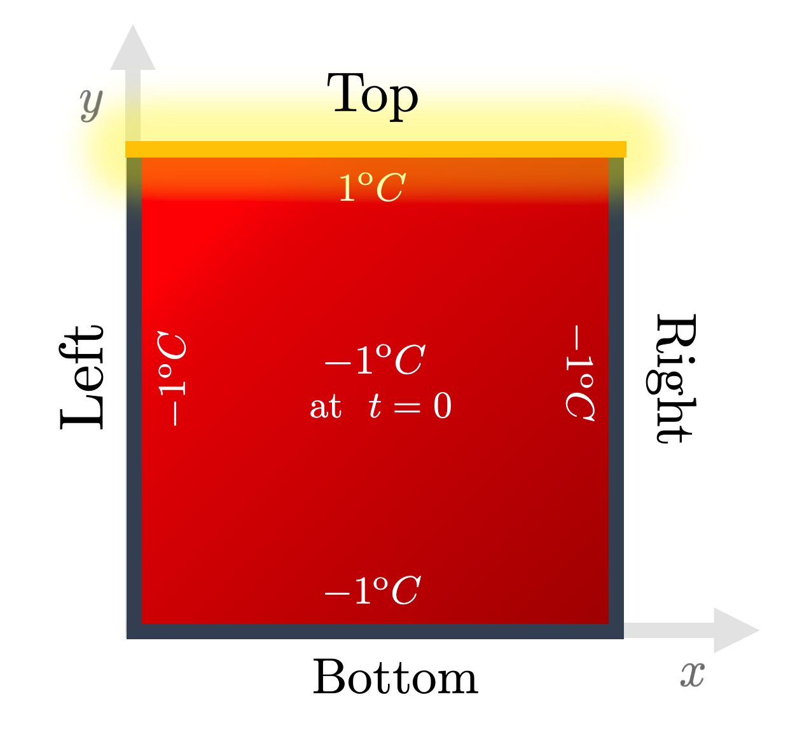

# The Heat Equation

**Authors**: Manuel Madeira, David Carvalho

**Reviewers**: Fábio Cruz

The world of classical simulation and the world AI are merging into a broader
form of computational solutions for science and engineering. In a previous
[tutorial](../generating-synthetic-data/synthetic-data-generation-1.md), we
showed how you could use Inductiva's simulation API to generate synthetic data
for training a GNN.

In this tutorial, we will go in a slightly different direction and we guide you
through an example one of the most exciting technical outcomes of this marriage
between classical simulation and AI: Physics-Informed Neural Networks, or PINNs
for short. The most notable difference between using PINNs vs using more generic
neural networks is that, in PINNs, we explicitly encode knowledge about the the
physical laws in the training loss of the neural network, allowing it to more
quickly converge to functions that are physically sound.

As a simple example, we will focus on the problem of 🔥 **heat diffusion** on a
plate! 🔥

We will take you step by step up to a point where you can gauge the potential of
Neural Networks in solving Partial Differential Equations:

1. **The Heat Equation**: introduces the physics behind heat diffusion.

2. **Finite-Differences**: classical numerical routine to approximate its
   solution across a 2D plate.

3. **Physics-Informed Neural Network**: with that estimate of the solution as a
   _benchmark_, see how **Machine-Learning algorithms** fare for the same
   situation, by deploying a PINN (Physics-Informed Neural Network).

4. **Generalized Neuro-Solver\***: explore further into how versatile these
   Neural Networks are in handling **more complex geometries** than the 2D
   domain and **varying initial/boundary conditions**;

This field is fast-growing but, most importantly is at its _blissful infancy_
stage. Our dream, rooted in a belief, is that Machine Learning may be refined to
excel in extremely complex and customizable cases.

This sophistication could potentially fare better in performance than every
other classical solver, allowing us to go to lands classical frameworks have
never granted us so far!

Alright. 🔥 _Let's get hot in here!_ 🔥

## The Heat Equation: a warm-up

Everybody has an elementary feeling for what heat is. _Heat diffusion_ is the
process through which energy is transported in space due to gradients in
temperature.

These considerations are reflected mathematically in the so-called _Heat
Equation_, which sets how the temperature $u(t, \mathbf{r})$ at a point in space
$\mathbf{r}$ and time instant $t$ evolves. It must satisfy:

$$
\begin{equation}
\frac{\partial u (t, \mathbf{r})}{\partial t} - D \Delta u(t, \mathbf{r}) = 0.
\end{equation}
$$

The thermal diffusivity $D$ controls how fast heat can spread around a
neighborhood. For more realistic (and oftentimes less structured) media, their
specifics result in a _local_ diffusity $D(t, \mathbf{r})$. In the _Heat_
series, we consider homogeneous media, for which $D$ is constant throughout.

Now, what about $\Delta$ --- the _Laplacian_ operator? Let's see how it acts on
a function $u$:

$$
\Delta u = \nabla \cdot (\nabla u) = \sum_{i} \frac{\partial^2 u}{\partial {r_i}^2}
$$

So we have $n$ $2^\rm{nd}$-order partial spatial derivatives to account for but
also a single $1^\rm{st}$-order partial derivative in time. That's a large batch
of **differential operators** right there. We can lump them into a single
_differential operator_ which governs the evolution of the solution we're after:

$$
\mathcal{L} \left[ \frac{\partial}{\partial t}, \frac{\partial^2}{\partial^2_{r_1}}, \dots \frac{\partial^2}{\partial^2_{r_n}} \right] u(t, \mathbf{r}) = 0
$$

Alright --- no doubt we're in the presence of a **Partial Differential
Equation**.

_These beasts are not easy to tame_. However, throughout the _Heat_ series, we
exploit the structural simplicity of the Heat Equation --- alongside the fact it
is both very intuitive to understand and easy to set up meaningfully.

### Heating across a 2D square plate

We'll guide you on how to solve this equation in a simple yet realistic
geometric setup: across a _2-dimensional plate_ of variable size [2].

As you will soon see, this domain is simple enough not only to allow intuitive
visualization but also to provide the possibility of adding extra complexity
without much effort.

So let's have a go. Our spatial vector in 2 dimensions is $\mathbf{r} = (x, y)$
and so the heat equation takes the form:

$$
\left[ \frac{\partial}{\partial t} - D \left( \frac{\partial^2}{\partial x ^2} + \frac{\partial^2}{\partial y ^2} \right) \right]u(t,x,y)= 0
$$

From a computational point of view, it will do us a favor to think in terms of
the result upon applying each differential operator to the solution:

$$
\begin{equation}
u_t - D \left( u_{xx} + u_{yy} \right) = 0  \label{HE_2D}
\end{equation}
$$

where the partial derivatives are shorthanded to, say,
$\partial_{x} \equiv \partial / \partial x$ and
$\partial_{xx} = \partial_{x} \partial_{x}$.

But hold on! We can't start solving this beast just yet...

### Setting boundary and initial conditions

We need more information to formulate completely this PDE. **Initial and
boundary conditions** ensure that a _unique_ solution exists by the function at
particular points $(t,x,y)$ of the input space.

These are normally reasoned through intuition and hindsight. Throughout the
_Heat_ series, we employ _Dirichlet boundary conditions_, which ensure:

- through the _initial condition_, that a certain temperature is fixed across
  _all_ points on the plate at the initial time instant (when $t=0$). We'll take
  $ u(0, x, y) = -1 ^\mathrm{o}C $.

- through the the _boundary conditions_, that a temperature is fixed at _all_
  times _only_ for points along the 4 edges of the plate (top, bottom, left and
  right). - We choose the energy source to act as to get the top edge to some
  hot temperature. We'll take $u(t, x, y_\mathrm{max}) = 1 ^\mathrm{o}C \ .$ -
  The remaining edges are held at some cold temperature. We'll take
  $\underbrace{u(t, x, y_\mathrm{min})}_{\text{Bottom}} = \underbrace{u(t, x_{\mathrm{min}}, y)}_{\text{Left}} =  \underbrace{u(t, x_\mathrm{max}, y)}_{\text{Right}} = -1 ^\mathrm{o}C \ .$

    

Fig. 1: The boundary and initial conditions used throughout the Heat series.
Energy is pumped from the top edge onto an initially completely cold 2D plate.
Credits: David Carvalho / Inductiva.

### Classical Numerical Methods

As usual, finding governing equations from first principles is actually the easy
part. Rather, solving them presents us major challenges. Why?

**Most PDEs do not admit analytical, pen-and-paper solutions.** Only a handful
of cherry-picked differential operators can give rise to closed-form solutions.
_Lesson learnt_ --- **numerical approximations** must be used.

> But which ones? In which conditions? For what type of PDE?

These are general and difficult questions to answer. Wildly different methods
have been curated by the computationally-inclined in the Mathematical and
Physical communities --- not as recipes set on stone but rather frameworks prone
to constant scrutiny.

_Mesh-based methods_ are traditionally the dominant approaches. The main idea is
to **discretize** the domain of interest into a set of mesh points and, with
them, approximate the solution. A whole zoo of methods exists, in particular:

- **Finite Differences Methods (FDMs)** replace the PDE expression with a
  discretized analogue along a grid with the aid of _function differences_.
- **Finite Elements Methods (FEMs)** subdivide the problem domain in multiple
  elements and apply the equations to each one of them.
- **Finite Volume Methods (FVMs)** builds a solution approximation based on the
  exact computation (taking advantage of the divergence theorem) of the average
  value of the solution function in each of the smaller sub-volumes in which the
  domain is partitioned.

All these methods have their advantages and shortcomings given the
idiosyncrasies of each PDE and setup of the problem. Sometimes they may even
coincide --- for some simple scenarios (such as regular grids) FEMs and FDMs
_might_ end up being the same [1].

Typically, mesh-based classical routines tend to be very efficient in
low-dimensional problems on regular geometries. We will then use this
convenience to our advantage by applying **a FDM in a FTCS (Forward in Time,
Centered in Space) scheme.**
