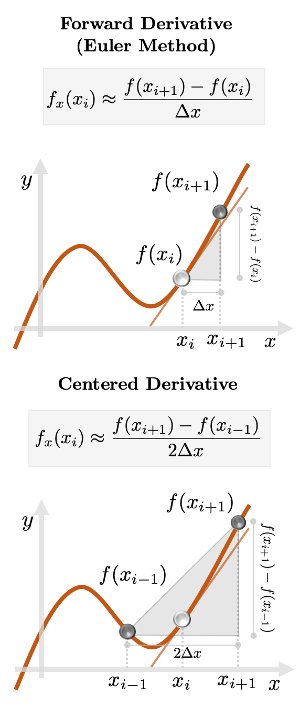

# Finite-Differences

**Authors**: Manuel Madeira, David Carvalho

**Reviewers**: Fábio Cruz, Augusto Peres

## Discretizing our domain

Deciding how to discretize the domain is also _far_ from being set on stone: for
a given instantiation of a PDE problem, it is typically one of the most complex
steps in its resolution. Squares are cool and all but what if we want to
simulate the Heat Equation in a mug or a pan?

We'll make our lives easier (for now!) by using a _regular grid_ to represent
the domain. With the aid of the cube:

$$
(t,x,y) \in [t_\mathrm{min}, t_\mathrm{max}] \times [x_\mathrm{min}, x_\mathrm{max}] \times [y_\mathrm{min}, y_\mathrm{max}]
$$

in a regular grid with $N_t$, $N_x$ and $N_y$ points along the $t$, $x$ and
$y$-axis, respectively, we can set their step intervals, defined by their
regular spacing along their respective dimension:

$$
(\Delta t, \Delta x, \Delta y) = \left( \frac{t_\mathrm{max} - t_\mathrm{min}}{N_t-1}, \frac{x_\mathrm{max} - x_\mathrm{min}}{N_x-1}, \frac{y_\mathrm{max} - y_\mathrm{min}}{N_y-1} \right)
$$

Consequently, input points $(t,x,y)$ become discretized as $(t_k, x_i, y_j)$ and
associated with a node $[k,i,j]$. Here,

$$
(t_k, x_i, y_j) =
\left\{
\begin{matrix}
t_k = t_0 + k \Delta t \ \ \ \ \ \ \ \ \ \ \ \ \text{for} \ 0 \leq k \leq N_t-1 \\
x_i = x_0 + i \Delta x \ \ \ \ \ \ \ \ \ \ \  \text{for} \ \ 0 \leq i \leq N_x-1 \\
y_j = y_0 + j \Delta y \ \ \ \ \ \ \ \ \ \ \ \text{for} \ 0 \leq j \leq N_y-1
\end{matrix}
\right.
$$

It is in this _pixelated_ world we will express how heat will diffuse away...

## From continuous to discrete derivatives

So, we now need to express a differential operator in a finite, discretized
domain. How exactly do we _discretize_ such abstract objects, like the
(univariate) derivative $f_x(x)$:

$$
f_x(x) = \underset{\Delta x \to 0}{\mathrm{lim}} \; \frac{f(x+ \Delta x) - f(x)}{\Delta x}.
$$

or a partial derivative with respect to, say, a coordinate $x_j$:

$$
f_{x_j}(x_1, \dots, x_j,\ldots,x_N)= \underset{\Delta x_j \to 0}{\mathrm{lim}} \; \frac{f(x_1, \dots, x_j + \Delta x_j, \dots ,x_N) - f(x_1, \ldots,x_j, \dots, x_N)}{\Delta x_j}
$$

Being on a grid means that we require information on a _finite_ number of points
in the domain. The FDM philosophy is to express (infinitesimal) differentials by
**(finite) differences** between any nodes.

The _continuous_ thus becomes _discrete_ --- the differential operator
$\mathcal{L}(t,x,y)$ becomes a function-valued discrete _grid_
$\equiv \mathcal{L}[k,i,j] = \mathcal{L}(t_k,x_i,y_j) $.
Resulting from this, so will our solution be output as the grid $u[k,i,j]$.

In essence, we must find an algorithm which can propagate the constrains set by
the PDE from the initial conditions as faithfully as possible along the grid. In
a more specific sense, you might wonder:

> How to approximate $\mathcal{L}$ _reasonably_ to obtain $u[k,i,j]$ for all
> nodes $[k,i,j]$?

This is exactly what the FDM solver will accomplish. For that, it has to
approximate the differential operators --- $u_{t}[k,i,j]$, $u_{xx}[k,i,j]$ and
$u_{yy}[k,i,j]$ --- **at all nodes** $[k,i,j]$.

_Goodbye operators, hello grids!_

## Finite Difference Method

Approximating differentials on a discrete set is also not a recipe set on stone.
Let us look at two Finite Difference approximations to a function of a single
variable $x$:

<div class="align-center">
    
</div>

Fig. 2: Approximation schemes of the derivative of $f(x)$ at a grid point $x_i$
using - (left) _forward_ and (right) _centered_ schemes. Note that either method
differs from the _actual_ value $f_x(x_i)$, given by the slope of the solid
straight line. Credits: David Carvalho / Inductiva.

These will estimate the true instantaneous rate via neighboring differences.
Expectedly, an error will be incurred in the process.

The price to pay in "dropping" the limit results in a 1st-order approximation,
meaning this estimate scales _linearly_ with the spacing $\Delta x$. For our
approximation to have a chance to succeed, we better sample the $x$ axis with a
high $N_x$!

## Choosing how to spread heat

Given a particular PDE, different FDMs would iterate differently over the grid
**node by node** to obtain estimates of the differential operators. \
So, fixing _a scheme_ is (again) delicate task.

You guessed it right - for this problem, we will use the 2 approximation schemes
we showed before to evaluate the differential operators. They are combined in
the _FTCS scheme_:

- **Forward in Time** - the time partial derivative $u_t$ uses the _forward_ 1st
  order differences

    $$
       u^{k, i, j}_t = \frac{u^{k+1, i, j} - u^{k, i, j}}{\Delta t} 
    $$

- **Centered in Space** - the spatial partial derivatives $u_{xx}$ and $u_{yy}$
  are are computed through a 2nd-order _central difference_ by applying the
  centered difference _twice_: - We first approximate the (second-order)
  derivative (say, $u_{xx}$) via the centered difference:

    $$
    u^{k, i, j}_{xx} = \frac{u^{k, i+\frac{1}{2}, j}_x - u^{k, i-\frac{1}{2}, j}_x}{\Delta x}
    $$

    - And then express each first-order term $u_x$ in the same fashion e.g.:

    $$
    u^{k, i, j}_{x} = \frac{u^{k, i+\frac{1}{2}, j} - u^{k, i-\frac{1}{2}, j}}{\Delta x}
    $$

    - With a bit of rearranging, both spatial derivatives become:

    $$
    \begin{split}
    u_{xx}^{k,i,j} = \frac{u^{k, i+1, j} - 2  u^{k, i, j} +  u^{k, i-1, j}}{(\Delta x)^2} &&
    \ \ \ \ \ \
    u_{yy}^{k,i,j}= \frac{u^{k,i,j+1} - 2 u^{k,i,j} + u^{k,i,j-1}}{(\Delta y)^2}
    \end{split}
    $$

Look --- some terms are evaluated _outside_ the original grid. However, you will
notice that these fractional indexes only appear for the computation of
intermediary constructions/variables [4].

## Heat diffusion on a grid

_Phew_! That was intense but we now have all the tools to start simulating heat
flow! For that, we must:

1. _discretize the domain_ by sampling each dimension individually and
   considering all possible combinations of the coordinates, creating points
   $(t_k,x_i,y_j)$, indexed by nodes $[k,i,j]$.
2. _discretize_ the differential operators using a FTCS scheme.
3. solve for the solution grid $u[k,i,j]$ by using the _iteration rules_ that
   propagate the solution across all nodes $[k,i,j]$.

In this fashion, we convert the 2D Heat Equation to this **difference
equation**:

$$
u^{k+1, i, j} = \alpha (u^{k, i+1, j} + u^{k, i-1, j}) +
                \beta  (u^{k, i, j+1} + u^{k, i, j-1}) +
                (1 - 2\alpha - 2\beta) u^{k, i, j}
$$

where we can lump all parameters in the ratios:

$$
\begin{split}
\alpha \equiv D\frac{\Delta t}{(\Delta x)^2} \ \ \ \ \ \ && \ \ \ \ \ \ \
\beta \equiv D \frac{\Delta t}{(\Delta y)^2}.
\end{split}
$$

We can understand how knowledge about the function **propagates** along the grid
with a _stencil_ by depicting which input grid points are needed to iterate the
algorithm so a solution estimate may be computed at all grid points.

<div class="align-center">
<video class="mb-0" loop muted autoplay preload="auto">
    <source src="../_static/pdes/fdm_animation.mp4" type="video/mp4">
</video>
</div>

Fig. 3: A stencil used by the FTCS scheme. At a given node $[k,i,j]$, the
solution is propagated forward in time as $u[k+1,i,j]$ by considering the
2-point centered derivatives in $x$ (the neighboring nodes $[k,i+1,j]$ and
$[k,i-1,j]$) and in $y$ (the nodes $[k,i,j+1]$ and $[k,i,j-1]$). <br> Credits:
Augusto Peres, Inductiva.

## Run our code

It's time to play with all these concepts and see how our FDM approximation
fares.

**All our code can be accessed on our
[code snippets GitHub repository](https://github.com/inductiva/blog_code_snippets)**.
There, you will find the `heat_fdm.py` file for simulations and plotting
utilities in `/utils`. \
Have a go yourself!

## The role of the $D$-ffusivity

We will pick a spatial discretization of, say, $500 \times 500$ points. We can
now run for different thermal diffusivities and see their effect. Below you can
see the temperature profiles as we increase $D$ --- first with $D=0.01$, then
$D=0.1$ and finally $D=1$.

<div class="align-center">
<video class="mb-0" style="width:80%;" loop muted autoplay preload="auto">
    <source src="../_static/pdes/ftcs_d001.mp4" type="video/mp4">
</video>
<video class="mb-0" style="width:80%;" loop muted autoplay preload="auto">
    <source src="../_static/pdes/ftcs_d01.mp4" type="video/mp4">
</video>
<video class="mb-0" style="width:80%;" loop muted autoplay preload="auto">
    <source src="../_static/pdes/ftcs_d1.mp4" type="video/mp4">
</video>
</div>

Fig. 4: Role of various $D$ in the diffusion. Credits: Manuel Madeira /
Inductiva.

## Heat is on the plate!

We can reason with these results.

- At the beginning (for $t=0$), heat starts developing from the only points that
  are not at the common temperature ($-1 \; ^\mathrm{o}C$), where temperature
  gradients exist. These are points nearby the hot (top) edge.

- From that point on, we can observe the progressive heat diffusion from the hot
  edge towards lower regions, until we reach a stationary state, where no
  further changes occur (and the system is in **thermal equilibrium**).

- Heat does not spread evenly across the plate --- its spread is faster in
  regions that are further from the cold regions. Given this symmetric setup,
  points along the central line between the edges allow for faster diffusion
  than regions nearby the edges. This will progressively wind down until we
  reach the cold edges and a paraboloid-like pattern is observed.

- But more importantly --- the higher the $D$, the faster this spread occurs.
  This **directly** impacts the choice of the time sampling.

So --- it seems that each **internal** parameter $D$ requires its own
discretization setup somehow. But in what way?

## Setting stability criteria

We ran our first PDE classical solver. _Yay!_ However, why are we happy with the
results? Clearly, we can think of potential issues, such as:

- for excessively sparse discretizations, our approximations of the differential
  operators will be miserably _undersampled_ and consequently the trial solution
  will be _shockingly wrong_.
- **error buildup** will take place as the iterative procedure tends to
  propagate and amplify errors between any iterations. In those cases, we say
  that the method is **unstable**.

However, these are the extreme instances. Were we lucky? If we are using
"reasonable" discretizations, a question should make you scratch your head:

> How to _be sure_ a certain discretization provides a trustful approximation to
> the PDE solution?

Fortunately for us, you can notice that the discretization setup can be
monitored **exclusively** through the ratios $\alpha$ and $\beta$! This raises
the question:

> Can we somehow fine-tune them to ensure _stability_ _i.e._ find admissible
> combinations of $(\Delta t, \Delta x, \Delta y)$ for a fixed $D$?

Well, theoretical studies can be performed to find a restricted space of
acceptable discretization setups. For our case [3], _Von-Neumann analysis_
establishes a surprisingly simple _stability criterion_:

$$
\alpha + \beta \leq \frac{1}{2}
$$

These two constants provide a straightforward procedure to be sure that we i)
are not **oversampling** or **undersampling** a dimension with respect to any
other and ii) have spacings that can capture meaningful changes of the solution.

**This is not a loose condition**. \
Just to show you that we're playing with fire, we cannot think of a more illustrative
example than by ramping up that bound by a mere $2 \% $ above
the theoretical maximum *i.e.* for $\alpha + \beta \approx 0.51$:

<div class="align-center">
<video style="width:80%;" class="mb-0" loop muted autoplay preload="auto">
    <source src="../_static/pdes/ftcs_unstable.mp4" type="video/mp4">
</video>
</div>

Fig. 5: In a discretization step for which $\alpha + \beta > 0.5$, our algorithm
is _bound to fail_. Credits: Manuel Madeira / Inductiva

Yup: for this setup, an "explosion" caused by the FDM instability can be seen
propagating along the trial solution --- quickly unfolding to some psychedelic
burst!

At the very beginning, some similarities to the downwards diffusion pattern (
that we just saw previously) quickly **fade away** as the **error buildup
spreads** away and **faster** in regions with already large errors.

It's a race for disaster: the exponential buildup of the errors, even if
sustained for only a handful of propagation steps, ensures that some nodes will
experience _huge growth_ (and $u$ becomes _unbounded_) --- $ u \mapsto 1 \mapsto
10^{15} \mapsto \dots 10^{80} \dots $, until the maximum computer precision is
reached --- at which point its value becomes a `NaN` (Not a Number). You can see
that eventually **all** points are not even represented on the scale (they're
white)!

By the same token, let's now see what happens if we're _close to the edge_ from
within the admissible area. Dropping our bound by
$2 \% $, let's heat the start
button for $\alpha + \beta \approx 0.49$.

<div class="align-center">
<video class="mb-0" style="width:80%;" loop muted autoplay preload="auto">
    <source src="../_static/pdes/ftcs_almost_unstable.mp4" type="video/mp4">
</video>
</div>

Fig. 6: With our parameters recalibrated, stability has been restored! Credits:
Manuel Madeira / Inductiva

_Incredible!_ Not even a minimal sign of instability coming through.

We're happy - we obtained seemingly satisfactory outputs in a reasonable way.
The simulations take about $10s$ and CPUs can handle the computation just fine.

But remember though: this is an extremely simple system... We could be
considering this problem in 3D or at way more complex domains and boundaries. In
an extreme limit, we could be using these FDMs in highly-nonlinear equations
with hundreds of variables.

## _To Vectorize or Not To Vectorize_ -- that is not the question

Understandingly, instructing how to compute many functions over a grid is not a
trivial task --- issues like computation power and memory storage can be
bottlenecks already for discretization setups _far from ideal_.

We must understand how our implementation choices affect the algorithm
performance and the output accuracy. In essence:

> How much faster can we solve the PDE without compromising the output?

Using the _running time_ as a metric, we'll compare 3 mainstream
implementations:

- **Nested `For` Cycles**: we fill in the entries for the plate at the new time
  frame $u^{k+1, i, j}$, by nesting 2 `For` cycles that iterate through the $x$
  and $y$ axes from the previous time frame in $u^{k, i, j}$.

- **Vectorized approach**: we perform arithmetic operations on $u^{k+1,i,j}$ by
  considering it as a linear combination of slightly shifted versions
  $u^{k,i,j}$, multiplied by constants (known _a priori_), resulting in scalar
  multiplications and additions of matrices. _NumPy_ implementations will be
  used.

- **Compiled approach**: we can compile a vectorized approach, which allows
  sequences of operations to be optimized together and run at once. The code
  compilation was performed through **JAX**, using its just-in-time (JIT)
  compilation decorator.

The approach used is passed as a flag: `--vectorization_strategy=my_strategy`. \
The default is set to `numpy` and the vectorized approach is used. When set to `jax`,
a compiled version of the vectorized approach is used and, when set to `serial`,
the nested _For_ cycles approach is used.

After running each implementation for the same parameters, we obtain _wildly_
different running times:

```
vectorization_strategy=serial - Time spent in FDM: 93.7518858909607s
vectorization_strategy=numpy - Time spent in FDM: 0.6520950794219971s
vectorization_strategy=jax - Time spent in FDM: 0.297029972076416s
```

_Wow!_ By using the vectorized approach, we obtain more than a $100$-fold boost
in running speed!

This is not surprising. The vectorized approach takes advantage **SIMD** (Single
Instruction, Multiple Data) computations, where one instruction carries out the
same operation on a number of operands in parallel.

This discrepancy is then easy to understand and a huge acceleration is observed,
in constrast when ran with the nested `For` cycles, where each instruction is
executed **one at a time**.

We are not done yet. By compiling the vectorized approach, we obtain yet another
$3$-fold speed-up, further improving our metric! This improvement would be even
more significant if we ran the compiled code in GPUs (currently, JAX still only
supports CPU in Apple Silicon machines).

Computation resources are finite (and costly). Despite the huge boost granted by
the compiled vectorized approach, this methodology improved our task by 2 orders
of magnitude. Is that enough when dealing with far more complex PDEs in higher
dimensions?

## How far can we push classical methods?

Despite our pleasant experience with a low-dimensional problem on a regular
geometry, we should be careful thinking ahead. Classical methods for solving
PDEs have long been recognized for suffering from some significant drawbacks and
we will comment on a few:

## Meshing

Meshing becomes a daunting task in more complex geometries. Different
discretization setups can always be chosen but once one is fixed, we have
limited ourselves to computations **on the nodes generated by that particular
setup**. We can no longer apply _arbitrary smaller_ steps to approximate the
differential operators.

Worse still --- depending on the behavior of the differential operator, we might
need to focus on certain regions more than others. It's unclear how these
choices impact the quality of the approximations.

Discretizing the problem also creates a bias in favor of the grid points with
respect to all others.

> But what if there the PDE behaves differently outside the mesh?

The best we can do is to infer a solution through **interpolation** but this is
admittedly **unsatisfactory**.

### Scaling

Classical algorithms scale **terribly** with the PDE dimensions and grid
refinements.

For all the Complexity lovers out there --- you know that sweeping the regular
grid $[k,i,j]$ step-by-step requires algorithms of order
$\mathcal{O}(N_t N_x N_y)$. \
By simply refining our grid by $5$ times, we scale the number of nodes by a whopping
factor $5^3 = 125$ (!!!).

Similar bad news are expected as we consider simulations on PDEs for higher
dimensions. For a problem of 3D heat diffusion, the complexity grows as
$\mathcal{O} (N_t N_x N_y N_z)$ and naturally, $n$ dimensions scale as
$\mathcal{O}(N^d)$ --- an _exponential scaling_ of the algorithm with dimension.

## Feasibility

Even though we can rely on stability conditions, this does **not** mean we can
deploy them --- it may be computationally very, very, ..., heavy or simply
impossible.

As we saw, simulating a medium with _higher_ $D$ requires a _finer_ time
discretization. For some instances, satisfactory $\Delta t$ might be too small
to be practical and, in the extreme case, downright untenable!

This comes at a bitter price and is a **major** drawback of the FDM.

## Machine Learning?

PDE simulations must be **as fast and light as possible**. But can classical
methods, in general, get _fast enough_?

We can look farther ahead. Consider something extreme (but likely). Imagine our
task is to find parameters that lead to optimal performance for some problem.

Let us assume we have access to the theoretically fastest PDE classical solver,
foolproof to instabilities and extremely efficient in terms of memory and
processing.

> If hundreds, millions, ..., billions of intermediate PDE calculations had to
> be performed with that algorithm, could we afford the computational budget?
> Would the time elapsed be reasonable?

**Certainly not.** It is not difficult to estimate runtimes _comparable to our
lifetime_ (run across millions of processors!) to achieve some real-life
optimization tasks.

This would _forbid_ us from iterating across the parameter space fast enough ---
_Game over_.

Efficiency in classical methods **won't** provide the scaling we need to
overcome this barrier. \
**A new paradigm is needed.**

Fortunately, a large class of algorithms can handle this **curse of
dimensionality** exceptionally well. _Can you guess what we are talking about?_
\
Yup, _Deep Learning_!

In the following posts of this series, we will address how we can leverage on
those approaches to possibly overcome these issues raised by classical methods.

_Until then, don't melt away!_

## References & Remarks

[[1]](https://www.machinedesign.com/3d-printing-cad/fea-and-simulation/article/21832072/whats-the-difference-between-fem-fdm-and-fvm)
More on this FEM and FDM possible similarity here. \
[[2]](https://levelup.gitconnected.com/solving-2d-heat-equation-numerically-using-python-3334004aa01a).
The FDM-based approach we present is loosely following this excellent example that
inspired us.\
[[3]](https://www.uni-muenster.de/imperia/md/content/physik_tp/lectures/ws2016-2017/num_methods_i/heat.pdf).
More details of the derivation of this expression can be found here (pages
11/12). \
**[4]** There are more complex cases where it is convenient to define such _staggered
grids_ with fractional offsets to the original (e.g for Maxwell's Equations).
