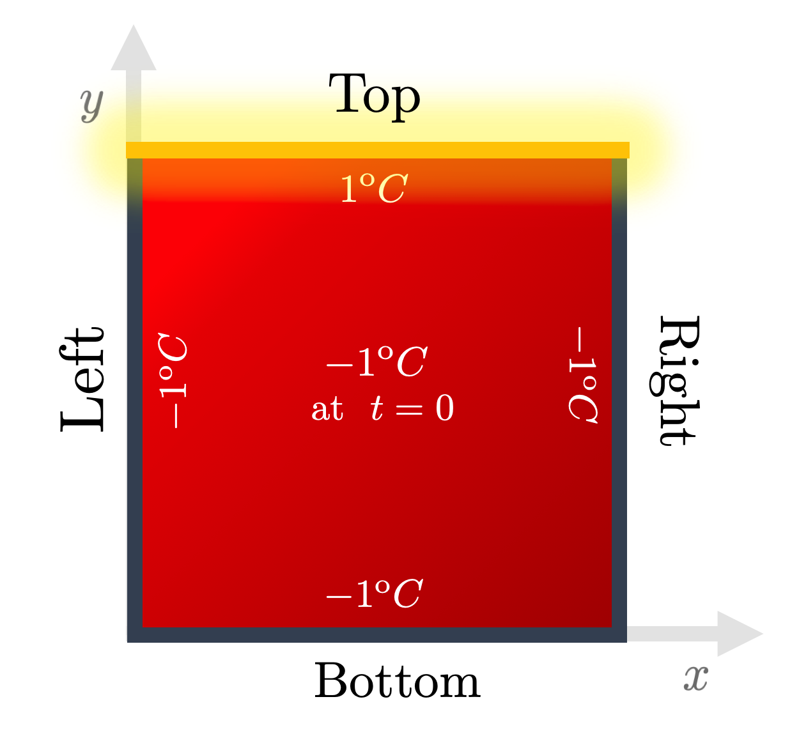

# Physics-Informed Neural Network

**Authors**: Manuel Madeira, David Carvalho

**Reviewers**: Fábio Cruz

As our scientific and technological needs evolve, it is not unrealistic to
expect problems depending on solving _billions_ of partial differential
equations (PDEs) with hundreds of variables and defined on high-dimensional
spaces with hard boundaries constraints.

Can Deep Learning lend us a hand in this regard? Let's find out!

Employing a disruptive ethos, in this post we will _hopefully_ convince you that
there is a whole lot of potential stemming from **Deep Learning** (DL) methods
in tackling this issue.

In recent years, huge developments in Machine Learning have been triggered by
ever-enhancing computational infrastructure and modeling sophistication.

In fields such as Computer Vision or Natural Language Processing, Deep Learning
(the sub-field of Machine Learning that handles Neural Networks (NNs)) has
evolved as to allow for huge advances in what can be done.

In fact, three extremely powerful points assure any researcher that NNs can be
leveraged in their field:

- the capability NNs have to succeed handling extremely high-dimensional spaces
  (for which we have motivated bottleneck-level issues due to the _curse of
  dimensionality_ will almost invariably arise);
- theoretical guarantees of success, namely due to the _Universal Approximation
  Theorem_ [1];
- better still, all the DL software artillery available has dramatically lowered
  the entry barrier for deploying NNs frameworks. It has never been this easy to
  set up sophisticated models with a handful of lines of code!

It is no surprise that NNs started invading other territories and **Fundamental
Sciences are no exception.**

## Deep Learning for... Partial Differential Equations?

The underlying laws behind most natural sciences rely on equations dictating how
certain quantities vary in time and space. Naturally, we must wonder:

> Can we possibly solve such an abstract problem like a Partial Differential
> Equation (PDE) with the aid of NNs?

To answer this question, let's first formalize a bit. In PDEs, the unknowns are
functions which depend on various variables and are defined over some domain.
_Solving the PDE (or systems thereof)_ entails finding such functions.

For a single real-valued PDE with $n$ spatial variables $r_i$ and a single
temporal variable $t$, we are after a function
$u: \Omega \in \mathbb{R}^{n+1} \rightarrow \mathbb{R}^d$ which satisfies:

$$
\mathcal{F} \left[u, \frac{\partial u}{\partial r_i}, \frac{\partial u}{\partial t}, \ldots \right] = 0,
$$

where $d$ sets thedimensionality of the output. \
$\mathcal{F}$ is a _differential operator_ --- an operator which may depend on those
variables but also on the trial solution itself and, most importantly, on its _derivatives_.
In general, these derivative can involve any order term.

Our hope is thus to find a NN whose output trial solution can mimic the actual
PDE solution.

## Deep Advantages

_Guess what_? As parametric function approximators, NNs are particularly well
tailored for this problem.

If you recall what we discussed, many limiting issues are found when numerically
solving a PDE via a classical method by **discretizing** the domain --- usually
performed with Finite Difference or Finite Element Methods. Ideally, we would
like to circumvent these problems.

As we will soon see, PINNs (Physics-Informed Neural Networks) address most of
the previously mentioned limitations of the classical methods:

- they are **mesh-free**, making the interpolation for non-mesh points no longer
  a concern. Once trained, PINNs can be evaluated at any point of the domain of
  interest. The way the training is performed can also be adjusted so that the
  function-valued solution we seek can be found in very efficient ways;
- there is no such thing as **error buildup** or **instability** coming from the
  iterative nature and discretization imposed by the classical methods.

For now, it's clear --- we should express a solution of the PDE as a NN.

Buckle yourself up and let the fun begin!

## Physics-Informed Neural Networks (PINNs)

We will showcase you one of the hottest approaches to tackle PDEs from a DL
perspective --- Physics-Informed Neural Networks (PINNs) [2,3].

In what way does this architecture differ from more conventional NN models?
Well, firstly we:

- try to approximate the function solution to the PDE through a NN that fits
  some data points that are provided. Typically, these are points set by
  boundary and initial conditions but they can also be in the interior of the
  domain;
- constrain the space of functions from which the NN can learn by penalizing
  solutions whose partial derivatives do not satisfy the desired PDE.

The first point is commonplace in DL approaches. This simply entails a
'supervised' minimization procedure between the output and the _ground truth_
set by the conditions. This _flavor_ of architecture is normally termed
**vanilla**.

The whole novelty and potential of PINNs stem from the second term, which is the
one that fundamentally deviates from the vanilla DL by regularizing NN guesses.

It's this aspect that coins these NNs as _Physics-informed_: from all the NNs
that we could learn, we are imposing an inductive bias towards those that verify
the _Physics_ of the system at hand (_i.e._ what the conditions expressed in the
PDE enforce).

The idea of _Physics_ here is a bit misleading. PINNs do **not** have to pertain
to physical systems. By Physics, it is assumed that some strong principle or law
must be held across the system. Curiously enough, these tend to be expressed
precisely with PDEs!

## Training the PINN

But how can we obtain a NN that we are confident has mimicked the _actual_
solution of the PDE taking into consideration the two aforementioned notions?

Needless to say, there are _many_ answers, depending on the problem at hand. For
instance, we could

- try to construct (activation) functions that necessarily respect the
  differential equation;
- if, say, the PDE were linear, use linear combinations of solutions so to
  respect the PDE;
- work in the spectral (frequency) domain --- where the derivatives could be
  tight by some relation --- and consequently an inverse fast Fourier transform
  could be used to map the solution to the direct domain.

### A Clever Loss Function

The answer that requires minimal change though is to tweak the way the loss
function is computed. This _objective_ function $\mathcal{L}$ is parametrized by
tunable parameters $\mathbf{\theta} = (\theta_1, \theta_2, ...)$ and dictated by
the model. In order to **learn** the solution, this loss must be **minimized**.

We want to make the loss as small as possible. Once we're in that regime, we can
be fairly sure our trial output is _somehow_ close to the _true_ solution and we
can say our model has **learnt** how to solve the PDE.

Tracking the behavior of $\mathcal{L}$ allows the NN to adjust its internal
parameters towards the values that lead to a smaller loss and thus to the best
approximation of the PDE output by the NN.

Considering this motivation --- admittedly more mathematical --- we can now
formulate the impact of each term on the overall loss through an individual
term:

- **Output values loss** $\mathcal{L}_\mathrm{data}$ --- any loss that penalizes
  a NN that does not verify the value function at the several prescribed points.
  For instance, we can consider a Mean Squared Error function between the values
  output by the NN and the target ones (which we know _a priori_):

    $$
    \mathcal{L}_\mathrm{data} = \frac{1}{N} \sum_{i=1}^N \|\hat{u}(t^i, r^i_1, \ldots, r^i_n) - u^i\|^2,
    $$

    where $\hat{u}(\ldots)$ is the NN estimate and $u^i$ is the
    *ground truth* value of $u$ at the point $(t^i, r^i_1, \ldots, r^i_n)$.

    Typically, the $N$ points used to compute $\mathcal{L}_\mathrm{data}$
    are drawn from the initial and the boundary conditions, but this is *not* strict ---
    those could be any points!

- **PDE "Regularization"** $\mathcal{L}_\mathrm{PDE}$ --- a term which penalizes
  models that do not satisfy the PDE. To achieve this, we can use a little
  trick. Since we wrote our PDE in the form $\mathcal{F}[u, \ldots]=0$, we want
  the left-hand side to be as close to $0$ as possible. We can then simply make
  sure our mimicking function $\hat{u}$ yields the lowest loss:

    $$
    \mathcal{L}_\mathrm{PDE} = \frac{1}{N} \sum_{i=1}^N \|\mathcal{F}[\hat{u}(t^i, \mathbf{r}^i)]\|^2.
    $$

    Easier said than done. This is a colossal task for each parameter instantiation
    of our NN (hundreds of billions of parameters may have to be recalibrated!)

    However, we can benefit from the auto-differentiation artillery that has been
    developed for NNs: the available packages allow for a straightforward
    and efficient way of obtaining the partial derivatives with respect to the
    many model inputs.

    In contrast to the first point, this loss term can be applied to *any*
    point, given that we do not require prescribed target values.

We are now in conditions to obtain a total loss term by summing both loss terms:

$$
\mathcal{L}_\mathrm{PINN} = \mathcal{L}_\mathrm{data} + \mathcal{L}_\mathrm{PDE}.
$$

Even though both terms were weighted evenly, this is not a requirement.
Actually, it is quite common to find this loss defined as a convex combination
of those two terms, where the weighting coefficient is an extra hyperparameter
requiring appropriate fine-tuning.

But putting these and other technicalities aside, this is pretty much what you
need to know about PINNs to follow the rest of this post!

<div class="align-center">
    
</div>

Fig. 1: The PINN we used to solve the 2D Heat Equation consists of two parts:
firstly, by updating the NN's weights $\mathbf{W}$ and biases $\mathbf{b}$ we
can minimize the residual difference between the model and the prescribed values
at some selected points; then the NN output is also optimized so that
$\|\mathcal{F}[u, \ldots] \|$ gets as close to 0 as possible. Credits: David
Carvalho / Inductiva

### IDRLnet: a PINNs library

To set a DL algorithm, we use
[IDRLnet](https://idrlnet.readthedocs.io/en/latest/index.html), a PINNs library
built on Pytorch [4]. To the best of our knowledge, it is one of the most
versatile open-source PINNs library.

The IDRLnet library has an architecture based on three different types of nodes:

1. **`DataNodes`** - these are essentially domains that are obtained from
   Geometric Objects (also provided by the library), from where it is possible
   to sample the points used to train the PINN;
2. **`NetNodes`** - these are abstracted from neural networks, _i.e._ the
   architecture, training hyperparameters, and everything else related to the NN
   used are defined in this node;
3. **`PDENodes`** - these contain all the information related to the PDE we wish
   to solve. Contrarily to NetNodes, PDENodes do not have trainable parameters.

Fine --- we are ready to try it out on our new favorite PDE: the 2D Heat
Equation!

## Hot NN Coming Through!

To keep things simple, let us start with the exact same situation as the one
presented for FDM:

<div class="align-center">
    
</div>

Fig. 2: The boundary and initial conditions used throughout the Heat series.
Energy is pumped from the top edge onto an initially completely cold 2D plate.
Credits: David Carvalho / Inductiva.

A very simple domain was chosen --- a regular 2D square plate. We must then
consider points of the form $(t, \mathbf{r}) = (t, x, y)$. The temperature
$u(t, \mathbf{r})$ must satisfy _the 2D Heat Equation_:

$$
\left[ \frac{\partial}{\partial t} - D \left( \frac{\partial^2}{\partial x ^2} + \frac{\partial^2}{\partial y ^2} \right) \right]u(t,x,y)= 0
$$

Recall that the hot edge was kept at the _maximal_ temperature
($1\;^\mathrm{o}C$), while the remaining boundaries at the _minimal_ temperature
($-1\;^\mathrm{o}C$). Initially, at $t=0$, all points were kept at the minimal
temperature too.

This prescription allows us to compute the loss term
$\mathcal{L}_{\mathrm{data}}$. As for the regularization, the loss term
$\mathcal{L}_{\mathrm{PDE}}$ is:

$$
\mathcal{L}_\mathrm{PDE} = \frac{1}{N} \sum_{i=1}^N \left\|\left[ \frac{\partial}{\partial t} - D \left( \frac{\partial^2}{\partial x ^2} + \frac{\partial^2}{\partial y ^2} \right) \right]\hat{u}(t^i,x^i,y^i) \right\|^2= 0.
$$

## Time to Heat [Start]

You can find our code [here](https://github.com/inductiva/blog_code_snippets)
and run your very first PINN! Run this experiment through the following
instruction in the command line:

```
python heat_idrlnet.py --max_iter=10000 --output_num_x=500 --output_num_y=500 --colorbar_limits=-1.5,1.5
```

The flags used trigger the following instructions:

- `max_iter` defines the total number of training epochs;
- `output_num_x` and `output_num_y` define the discretization along the x-axis
  and y-axis, respectively, of the grid in which we infer results;
- `colorbar_limits` defines the range of the colorbar used.

For illustrative purposes, we set the diffusivity constant to $D=0.1$ throughout
the entire post.

**Disclaimer:** our code is able to accommodate some extra complexity that is
not needed in this post. For now though, we will not dive in detail but let the
magic happen in the next section 😎.

## Classical vs NN --- the fight begins

To see how well our NN-based framework handles the task, we can compare the NN
output to the one generated from the classical Finite-Differences algorithm:

Let's plot the output obtained with the FDM (a classical algorithm) [top] and a
PINN we trained [middle], as well as the error
$\text{Error} = |u_{\rm FDM} - u_{\rm PINN}|$ [bottom]. This error plot can be
easily computed by running the provided `heat_error.py` python script.

<div class="align-center">
<video class="mb-0" style="width:80%;" loop muted autoplay preload="auto">
    <source src="../_static/pdes/fdm.mp4" type="video/mp4">
</video>
<video class="mb-0" style="width:80%;" loop muted autoplay preload="auto">
    <source src="../_static/pdes/idrlnet_10000epochs.mp4" type="video/mp4">
</video>
<video class="mb-0" style="width:80%;" loop muted autoplay preload="auto">
    <source src="../_static/pdes/error_10000epochs.mp4" type="video/mp4">
</video>
</div>

Fig. 3: Comparison of the results obtained via a classical algorithm (a
FDM)[top], a DL algorithm (the PINN computed with IDRLnet)[middle] and the
absolute value of their difference [bottom]. They seem very similar! Indeed, an
inspection of the error shows global convergence. Credits: Manuel Madeira /
Inductiva

Wow --- this looks rather good!

The NN output approximates quite closely the results obtained with FDM. There
are some deviations mainly in the initial instants and then in the upper
corners. Actually, these are the regions where sharper transitions of the
solution function are found, and it is thus natural that our PINN has more
difficulty to fit correctly there.

This certainly seems hopeful --- but an inquisitive mind like yours must be
wondering about _why_ this PINN worked.

## How long should we train?

In order to train the PINN, a rather large number of epochs
($N_{\rm epochs}=10000$) was used for training.

This can make us think: just like the classical algorithm had to be tuned so no
nonsensical estimates were output, there must be some suitable tuning to assure
us the algorithm can indeed approximate the solution.

<div class="align-center">
<video class="mb-0" style="width:80%;" loop muted autoplay preload="auto">
    <source src="../_static/pdes/error_100epochs.mp4" type="video/mp4">
</video>
<video class="mb-0" style="width:80%;" loop muted autoplay preload="auto">
    <source src="../_static/pdes/error_1000epochs.mp4" type="video/mp4">
</video>
<video class="mb-0" style="width:80%;" loop muted autoplay preload="auto">
    <source src="../_static/pdes/error_10000epochs.mp4" type="video/mp4">
</video>
</div>

Fig. 4: Difference between the PINN output after training with different number
of epochs and its respective classical output (serving as a benchmark). We can
see a substantial error for few epochs ($N_{\rm epochs} = 100$) [top]. If we
ramp up 10-fold ($N_{\rm epochs} = 1000$), the error is essentially gone
[middle] and even further suppressed for $N_{\rm epochs} = 10000$ [bottom]. For
this regime, both the classical and DL algorithms provide essentially the same
estimate. Credits: Manuel Madeira / Inductiva.

The results are just as we expected: the higher $N_{\rm epochs}$, the better the
NN learns. In this particular case, it seems that by around
$N_{\rm epochs} \approx 1000$ it already leads to appropriate learning. In
general, tuning this parameter can be costly (moreso if performed in a brute
force fashion).

Specific knowledge of the PDE or domain in question may make our lives
easier!...

## Customized training

The versatility of the PINNs in focusing on different regions differently begs a
question of the utmost relevance:

> Are we favoring or penalizing regions that require a different level of
> refinement?

Fortunately, via _TensorBoard_, it is possible to track various loss terms
throughout the training procedure by using the command

```
tensorboard --logdir [insert path to "network_dir"]
```

With it, we can then see the effect of extending the training procedure. For
this, we set different **numbers of epochs** and see how the output is impacted
by this choice.

<div class="align-center">
    
</div>

Fig. 5: Learning curves (in logarithmic scale) for different sub-domains. We can
see that, even though all terms have different behavior, they eventually
converge to exceedingly small values. Credits: Manuel Madeira / Inductiva.

You can see how the loss for various subdomains (the captions should be clear to
follow) changes as training takes place.

The training of PINNs (or generally with NNs), is **not** a completely trivial
task. In fact, from the learning curves above, it is clear that if we stopped
our training too early on, our results would be necessarily **worse**.

## The ghost of _overfitting_

We typically find overfitting whenever we train our model excessively with a
training dataset --- ultimately providing a strict fitting across the given data
points, or when training using a closed dataset (by _not_ using
randomly-generated data).

This leads to a huge drawback: **the model loses its generalization
capability**.

In other words, when we present the model to new **unseen** data still from the
same distribution that generated the training dataset, the model will have
_weak_ predicting power for those points and thus a **much higher** loss rate.

A validation set of data points is typically kept in parallel to the NN training
procedure to ensure, through periodic checks, that we do not enter such an
overfitting regime.

In this case, we do not have to worry about the possibility of overfitting for
two main reasons:

- firstly, we are sampling a different set of data points in each epoch, _i.e._,
  our training set is changing from epoch to epoch
- secondly, we are considering a regularization term in our loss (recall
  $\mathcal{L}_\mathrm{PDE}$).

Furthermore, we see that points coming from the boundary conditions are the most
troublesome ones --- due to their higher loss. To contrast this, FDM
implementations have those points directly _hard-coded_ onto the final solution.

## Learning Rate

Another typical issue impacting the performance of PINNs (and NNs in general) is
the choice of the learning rate $\alpha$.

This is a _hyperparameter_ --- a variable which pertains to the structure of the
model itself. The update of the NNs parameters is performed by applying
optimization algorithms, thus known as _optimizers_.

The way in which the learning rate is exploited in these optimizers varies.
However, we can intuitively think about it as the magnitude of the step given in
the parameters space in each iteration.

Striking a balance between _speed_ and _accuracy_ is not only a vital part of
setting the model but also a delicate task on its own.

A **larger** learning rate allows us to have larger updates in the parameters
and thus **faster** progress but at the same time it may lead to **large
instabilities** in the convergence process. In extreme instances, we may never
be in conditions to access the optimal regions.

To see this, let us see the effect of using larger and smaller learning rates
$\alpha$ than the one chosen in the previous experiment.

<div class="align-center">
    
    
</div>

Fig. 6: Learning curves (in logarithmic scale) for two different learning rates.
Note that a very large rate $\alpha = 0.1$ leads to curves that never get
smaller and so the NN is bound to fail [top]. Using a smaller rate
($\alpha=0.0001$) [bottom], although takes more time to run, indeed leads to
increasingly smaller losses. Credits: Manuel Madeira / Inductiva.

On the one hand, for $\alpha = 0.1$, the model runs rather quickly but the
learning curve stagnates quickly since further progress will not get us closer
to the optimal minima of the loss function -- we simply keep meandering in
parameter space!

Contrary to this regime, a small rate $\alpha=0.0001$ may take more time but
allows the model to eventually have ever-smaller losses.

Balancing performance, accuracy and computation resources surely is a
sophisticated feat!

## There is art in DL

The lesson we learnt here is that indeed NNs can be adequately trained to yield
estimates of PDE solutions **without explicit computation of the PDE**.

For that though, we must be crafty --- choices like the learning rate and the
number of epochs **directly impact** the performance of the PINN.

The fine-tuning of hyperparameters is not something set on stone and requires
subtlety and exploration to be successful. The technical aspects and their
formulation are still open topics and intensively studied in the DL+ML
communities.

Just as with FDMs we had to fine-tune the discretization parameters in order to
ensure the stability of the method, the same must be considered for PINNs ---
they are not a panacea! Even though it offers an edge in streamlining the
computation of the estimate, extra care is still needed!

NN architectures come in many flavors and recipes and may be improved in many
intuitive ways. As a general question, we can wonder:

> Should we take some inspiration from the classical methods and explore a
> direction where the boundary (and initial) conditions are hard-constrained in
> the learning problem (_e.g._ verified by construction)?

This is one of the questions that we are tackling at Inductiva --- and we will
show you more as progress is made 😛!

## Next episode

In the next (and final!) section of our tutorial, we will precisely unveil some
of the aspects that can make our problem harder to solve but also **more
realistic**.

In particular, we will show you how to extend this vanilla version of PINNs to
be able to:

- deal with complex geometries (rather than a simple square plate);
- solve a PDE to more than one instance of the boundary conditions without
  having to retrain the whole model again.

Neural Networks sure sound exciting, right? Stay tuned 🌶️!

## References

[[1]](https://en.wikipedia.org/wiki/Universal_approximation_theorem) A bit more
about the mathematical foundation for the suitabillity of NNs to model
challenging maps from input to output. \
[[2]](https://arxiv.org/abs/1711.10561) Defining papers outlining the architecture
and ideas of PINNs in the Literature. \
[[3]](https://www.sciencedirect.com/science/article/pii/S0021999118307125) Yet
another influential paper on PINNs. \
[[4]](https://idrlnet.readthedocs.io/en/latest/) Check out the documentation of the
IDRLnet library here.
