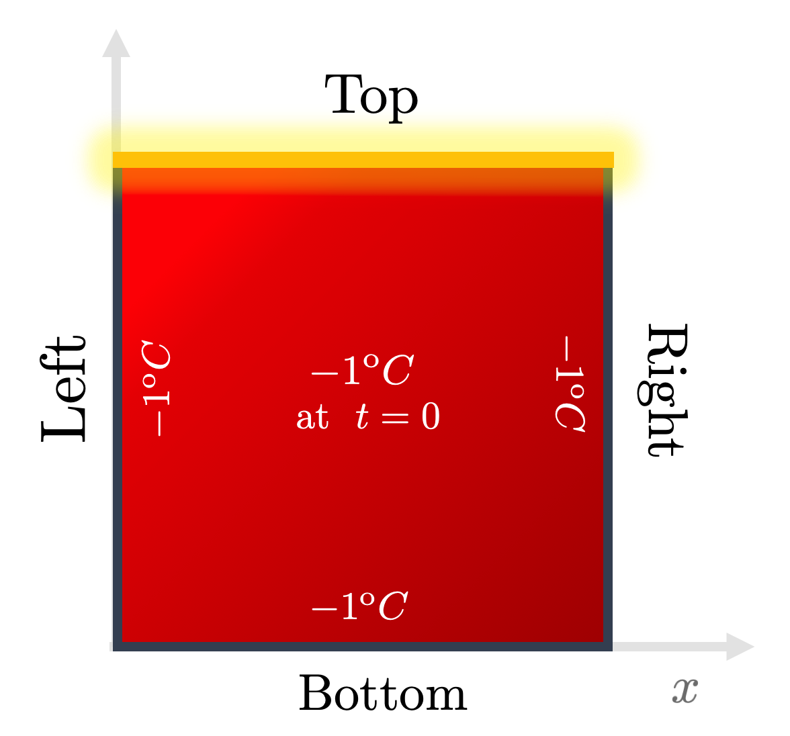
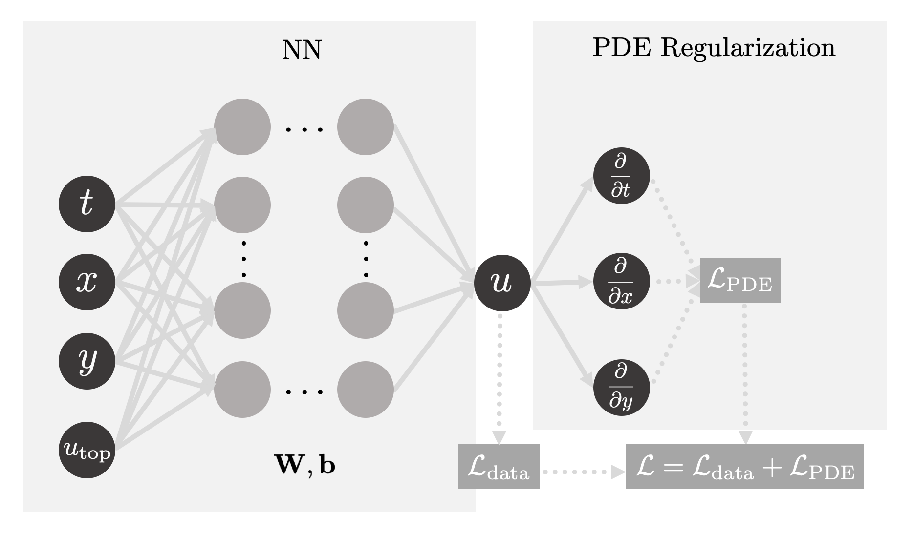
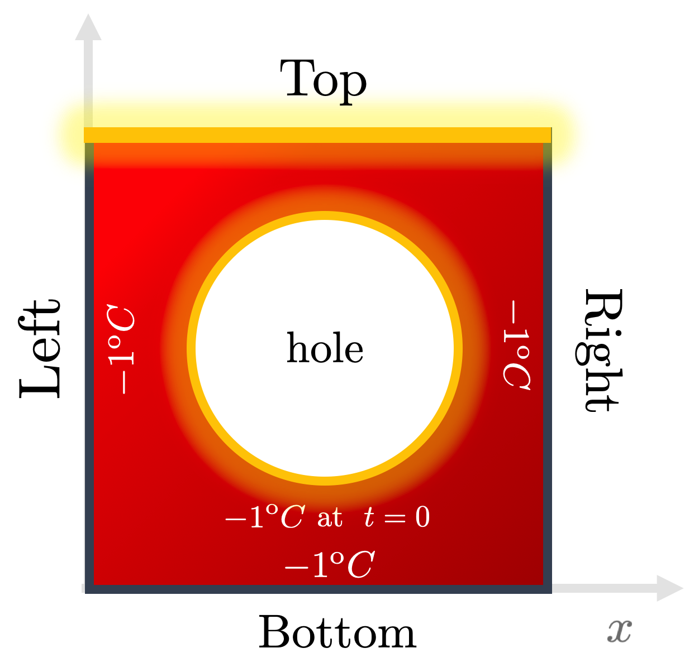
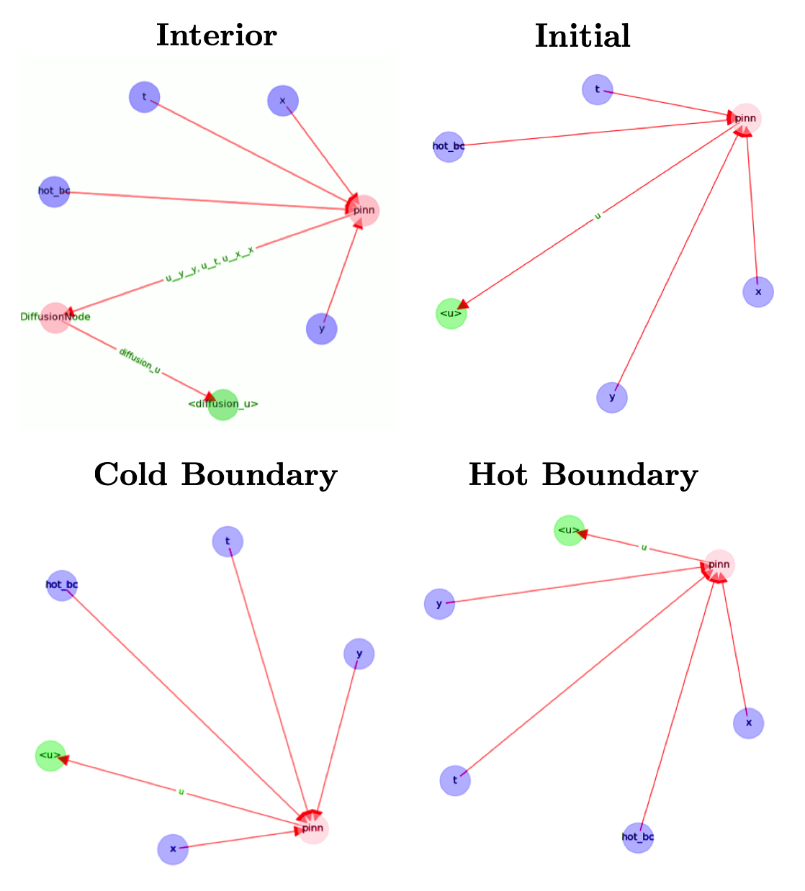

# Generalized Neuro-Solver

**Authors**: Manuel Madeira, David Carvalho

**Reviewers**: Fábio Cruz

In this section, we are going to show you that a grand unification of gravity
within a quantum field theory framework can explain topologically nontrivial
dynamics observed in simulations of graviton inelastic collisions in a AdS
space. Let's go!

<div class="align-center">

</div>

It's all good. We're just messing with your mental sanity!

_Ok_. Now that we have caught your attention, let us snap back to reality ---
maybe one day we will pay this topic some attention!

Even though we won't achieve such an ambitious goal as the one mentioned above,
in this final post of the _Heat series_, we are going to fulfill our overarching
promise:

> to showcase the strength and versatility of Neural Networks (NNs) in solving
> hard Partial Differential Equations (PDEs) in challenging domains and
> conditions.

In this final instalment of the _Heat series_, we delve once more into this
topic with the aid of our very cherished _Heat Equation_. So let's go!

## Introduction

So far in this series, we showcased a classical algorithm and a Neural Network
(NN) to solve the Heat equation. Both of these implementations were performed on
an **extremely simplistic (and unrealistic) scenario.** \
It is as straightforward as it can get:

- **the heat equation is a _linear_ PDE**: the solution function and all its
  partial derivatives occur _linearly_, without any cross products or powers and
  any spacial preference for any of the (only) two coordinates. _This form of
  PDE is one of the simplest we can face._
- **a very idealized medium with a constant diffusivity $D$ was used**:
  admittedly a huge simplification, as it assumes a perfectly homogeneous and
  stationary medium. In a more plausible setting, we would have to consider a
  function $D(t, x, y)$ instead.
- **very simplistic conditions**: the geometry considered of a square plate
  where the boundaries are _always_ kept fixed and the heat flow uniformly set
  up along the upper boundary is quite utopian in practice. Real-life plates
  have deformities, changes in density, imperfections...

So, we ought to ask the question:

> How can we strengthen our case --- that NNs can handle more complex and
> nontrivial cases?

This is exactly what we want to address. We will ramp up the complexity of these
scenarios and see how well NNs can _potentially_ fare.

This won't be done with much sophistication --- the approach we adopt is very
incremental and straightforward. Most importantly though, it serves the purpose
of a simple demonstration of the principle of **generalizing** learning
algorithms.

## Rethinking the NN architecture

Ok. What do we mean by _generalization power_?

Think of a PDE --- apart from the structure of the differential operators acting
on the solution, there are many other variations that can impact its behavior:
internal parameters (such as physical properties) but also the initial and
boundary conditions (IBCs).

Getting a NN to learn for a particular instantiation of these conditions is hard
on its own. We could naively consider adding extra dimensions and run a NN that
would be trained point by point by grid-searching on yet a bigger space.

This surely does **not** sound scalable. If we want to see the effect obtained
from ever-so-slightly different conditions on the same PDE, we have to rerun the
**whole** classical method or perform the **entire** NN training task again. \
_This is highly unsatisfactory!_

Worse still: the required time to train the PINN increases rather substantially.
_Generalization power_ requires _heavy_ computational resources and routines
that must handle the completion of the algorithm efficiently. In either case,
the **training time naturally becomes a major bottleneck**.

How to tackle these issues?

## Hard-(en)coding the variability

There are two direct answers --- either we directly:

- _decrease_ the training time by exploiting some magically-enhanced novel
  procedure which can accelerate the PINN's weights and biases fitting
  _somehow_. As we discussed before, this seems quite unlikely and it is unclear
  if this factor could counteract the scaling effects.

- _increase_ the yield from that training process: what if, for the same effort
  in training, we could obtain better predictions or cover a larger set of
  physical cases?

It is from the second direction that the generalization idea comes out. Given
that we will have to train our PINN anyway,

> why don't we try to make it learn the solution function for different sets of
> internal or external factors **from the get-go**?

We can do this by **hard-coding** the prescription of conditions or parameters
by including appropriate representations in input space **directly** in the
model. Only then we can say the model has a shot at _learning_ for generalized
cases.

But this isn't trivial by itself. Imagine you want to use a vanilla NN in a
supervised way. To train it, you would need a ground truth given by say, a
classical algorithm. Each such process would have to rerun for each new set of
parameters or conditions. This can take a lot of time.

On top of that, how to know which conditions to sample from? Depending on the
quality of the sampling used to generate the ground truth (in this case given by
a classical simulation algorithm), the model can now _in principle_ be used as
an **oracle** which, if well trained, will return confident outputs for
**unseen** parameters. But we now know sampling the phase space can be extremely
slow or downright unfeasible in this setting. So we may wonder:

> But what if we don't need a ground truth at all in our NN?

Well, we would **bypass** the need to run **expensive and heavy** classical
algorithms!

Granted, constructing efficient **neuro-solvers** is far from trivial. However,
the upshot of such hard and laborious work to get the model to learn the
_generalized task_ can be **huge** --- a _considerable advantage_ in favor of
NNs, as their inference can be **significantly faster** than classical methods.

If NNs succeed in this task, they can **potentially** solve PDEs in
theoretically **all** possible conditions! In this perspective, NNs supersede
"grid-like" algorithms where adding such parameters results in an
**exponential** curse of dimensionality.

_It sounds powerful, right?_

Now, let's get things on more concrete ground... You know the drill: _it's time
to get hot in here!_

## A neuro-solver for the Heat Equation

We have been advertising PINNs (Physics-Informed Neural Networks) for their
flexibility as a DL framework, so you guessed it right --- we are going to use
them to showcase how generalizational power can be harvested from picking
appropriate algorithms that can handle such beasts as _dem'_ mighty PDEs!

To test these notions of _generalization_, we will consider our usual setup of
heat diffusion across a 2D rectangular plate:

<div class="align-center">
    
</div>

Fig. 1: The usual initial and boundary conditions (IBCs) we assume to solve the
Heat Equation on the 2D plate. Credits: David Carvalho / Inductiva.

It states that the temperature profile $u(t,x,y)$ must satisfy:

$$
\left[ \frac{\partial}{\partial t} - D \left( \frac{\partial^2}{\partial x ^2} + \frac{\partial^2}{\partial y ^2} \right) \right]u(t,x,y)= 0,
$$

With it, let's investigate three topics:

- **Learning for parametrized boundary conditions**: keeping this admittedly
  simple domain, we _parametrize_ the top edge temperature $u_{\rm top}$ into
  our PINN. After the network has been trained, we compare its prediction for an
  _unseen_ top edge temperature by benchmarking it with respect to the classical
  algorithm (FDM) output.
- **Learning for different domains**: we see how well PINNs can solve when using
  more complex geometries. We will solve the Heat Equation with a PINN in a more
  challenging domain, where a spherical hole is punched into the interior of the
  plate.
- **Learning without generalizing**: we will benchmark how much slower it gets
  if generalization principles are neglected. In other words, we will adress
  generalization by brute force. Using our new holed plate, we will run PINNs
  that can solve across this harder domain _when trained (each at a time) for
  various diffusitivities $D$_.

### Let's Heat `run`

You don't need to program anything --- you can find and run our code in our
dedicated `github` repository
[here](https://github.com/inductiva/blog_code_snippets) and train your powerful
PINNs!

## Getting a PINN to generalize across boundary conditions

Until now, only **fixed** scenarios for which the boundary and initial
conditions were set _a priori_ were used (like the ones just above). In this
framework, the PINN is trained to fit **exclusively** with those conditions.

This is naturally far from ideal. If we were to change the initial temperature
of any edge **by a teeny tiny bit**, the model output for such a system would
already be of **dubious** predictive power!

So, we face a structural question here:

> How can we encode this boundary information as input to the PINN in a way the
> model can effectively generalize its effect on the output solution?

To answer this, let's focus on an extremely simple setup to showcase this
training capability. We will keep _all_ boundary and initial conditions fixed
_except_ for the temperature of the top edge, which can now _change_.

Once again, we pick the simplest approach to achieve generalization: via
**parametrization**. In this way, we think of encoding the variation by means of
_variables_ (or any other sensible descriptor) to allow the NN to extend the
solution function to other IBCs _natively_ in its architecture.

In this simple configuration, a single **parameter** $u_{\rm top}$ will become
an **additional** input.

<div class="align-center">
    
</div>

Fig 2: Our PINN will now be able to learn the behavior of the solution as the
hot edge temperature $u_{\rm top}$ is an input of the model. Credits: David
Carvalho / Inductiva.

To see how well the PINN fares, we:

- train it by sampling many instances of $u_{\rm top}$ within the range
  $[-1, 1]^\mathrm{o}C$.
- then infer for the unseen case $u_{\rm top} = 0^\mathrm{o}C$.

### Running...

Do you remember when in we mentioned that our implementation was able to
accommodate some extra complexity? Time to exploit it!

The command line instruction to trigger this experiment and generate the PINN
output is simply:

```
python heat_idrlnet.py --max_iter=10000 --output_folder=generalization_bc --hot_edge_temp_range=-1,1 --hot_edge_temp_to_plot=0 --output_num_x=500 --output_num_y=500 --colorbar_limits=-1.2,1.2
```

The script `heat_idrlnet.py` trains a PINN in the setting described throughout
the Heat series. The flags in this command line fulfill different purposes:

- `max_iter` defines the total number of training epochs;
- `output_folder` determines the directory where the resulting files stemming
  from the PINN training procedure are stored;
- `hot_edge_temp_range` is the range of hot edge temperatures within which the
  PINN is trained;
- `hot_edge_temp_to_plot` is the hot edge temperature to which we intend to
  infer results;
- `output_num_x` and `output_num_y` define the discretization along the x-axis
  and y-axis, respectively, of the grid in which we infer results;
- `colorbar_limits` defines the range of the colorbar used.

Let's analyze it by using a classical Finite Difference Method (FDM) for
$u_{\rm top} =0 \;^\mathrm{o}C$) as the benchmark.

<div class="align-center">
<video class="mb-0" style="width:80%;" loop muted autoplay preload="auto">
    <source src="../_static/pdes/generalization_bc.mp4" type="video/mp4">
</video>
<video class="mb-0" style="width:80%;" loop muted autoplay preload="auto">
    <source src="../_static/pdes/generalization_bc_fdm.mp4" type="video/mp4">
</video>
<video class="mb-0" style="width:80%;" loop muted autoplay preload="auto">
    <source src="../_static/pdes/generalization_bc_error.mp4" type="video/mp4">
</video>
</div>

Fig. 3: A PINN estimate of the solution of the Heat Equation for a top edge
temperature $u_{\rm top} = 0^\mathrm{o}C$ [top], the output generated by a
classical (FDM) method [middle] and their difference [bottom]. Credits: Manuel
Madeira / Inductiva.

Very nice! As expected, the network [top] recovers the diffusion patterns
predicted by the classical algorithm [middle]. We can track the error by
plotting their difference [bottom], where a great resemblance arises. This plot
can be easily obtained by running the provided `heat_error.py` python script. We
notice that the main source of error is found in the upper corners where cold
and hot edges get in touch, generating an extremely sharp transition that the
PINN struggles to keep up with.

Even though some minor numerical deviations are seen, these are justifiable
given that the task that we have provided to the PINN is **significantly
harder**, and we kept the total number of epochs and Neural Network architecture
as before in the series.

_Lesson:_ for the same amount of training, clever architectures can indeed
provide us the generalization power we sought, saving us a huge amount of
computation resources and with very little damage in results accuracy!

## Probing complex geometries

We are interested in testing PINNs for more complex geometries than the regular
square plate. Let us then now go the extra mile and address precisely the
challenges of probing **different domains** with NNs.

PINNs are particularly well suited to address complex geometries as it only
requires **a proper domain sampler** that provides both:

- boundary and initial points with the correct target value (given by the ground
  truth);
- and interior points where the PINN computes the PDE residual and then
  backpropagates it.

In fact, the PINN solution function will be defined for values outside of the
domain considered, but we just neglect it.

Our code implementation supports designing a plate with an arbitrary number of
holes inside the problem domain. Let's focus on a single hole at the plate
center:

<div class="align-center">
    
</div>

Fig. 4: We now generalize our boundary and initial conditions given the domain
by taking the top edge temperature as a variable parameter
$u_{\rm top} \in [-1,1] \;^\mathrm{o}C$, while the hole boundary is of the hot
or cold type. Credits: David Carvalho / Inductiva.

Given this, we keep the boundary and initial conditions as in the previous
setting (top edge at the maximal temperature ($u =  1\;^\mathrm{o}C$) and the
rest of the boundaries and initial points at the minimal temperature
($u = -1\;^\mathrm{o}C$).

We consider two types of holes now:

- **Hot hole**: The points sampled from the hole boundary are set to the maximal
  temperature ($u = 1\;^\mathrm{o}C$);
- **Cold hole**: Conversely, in this case, the points sampled from the hole
  boundary are set to the minimal temperature ($u = -1\;^\mathrm{o}C$).

## Running our code

Let's now get some code running! The instruction in the command line that leads
to the PINN results is the following:

```
python heat_idrlnet.py --max_iter=10000 --output_folder=hot_hole --holes_list=0,0,0.1 --output_num_x=500 --output_num_y=500 --colorbar_limits=-1.5,1.5
```

For instance, the cold hole setting can be run as:

```
python heat_idrlnet.py --max_iter=10000 --output_folder=cold_hole --holes_list=0,0,0.1 --holes_temp=-1 --output_num_x=500 --output_num_y=500 --colorbar_limits=-1.5,1.5
```

Regarding the new flags in these command lines:

- `holes_list` is the list of holes we consider in our plate, where each group
  of three contiguous entries define a hole as
  $(x_\rm{center}, y_\rm{center}, radius)$ ;
- `holes_temp` defines the temperature of the holes boundaries (it is not
  defined for the hot hole as it is $1\;^\mathrm{o}C$ by default);

So, for the same $u_{\rm top} = 1\;^\mathrm{o}C$, we see the difference in the
profile for both the cold and hot hole edge scenarios:

<div class="align-center">
<video class="mb-0" style="width:80%;" loop muted autoplay preload="auto">
    <source src="../_static/pdes/hot_hole.mp4" type="video/mp4">
</video>
<video class="mb-0" style="width:80%;" loop muted autoplay preload="auto">
    <source src="../_static/pdes/cold_hole.mp4" type="video/mp4">
</video>
</div>
Fig. 5: Heat diffusion profiles for a hot [top] and cold [bottom] temperature of the hole boundary. Case on point: small changes in parameters can result in very different outputs! Credits: Manuel Madeira / Inductiva.

_Woah_! The results from these experiments are clear: the hole in the domain
clearly affects the heat diffusion profile in **very different** outputs!

- When the hole boundary is cold, the heat source remains the same and so the
  same general downward parabolic-like behavior we've discussed is observed. The
  main difference is that heat flows _around_ the hole.
- The more interesting case occurs when we also pump energy into the plate
  through the hole boundary. In that case, another pattern is added -- a radial
  outflow. The interference between these two streams is obtained in opposite
  directions: while the cold hole suppresses the heat diffusion towards closer
  regions to the hole border.

But this is still intuitive enough. But how to think of a highly complex
interference pattern? Let's put our code handling more exotic domains!

For instance, let's think of more physically-relevant cases. Can we understand
the physics behind this irregular setting where 3 holes of various sizes and
positions are found and the boundary is now curved?

<div class="align-center">
<video class="mb-0" style="width:80%;" loop muted autoplay preload="auto">
    <source src="../_static/pdes/3_holes.mp4" type="video/mp4">
</video>

Fig. 6: Heat flow across a more complex domain composed of three holes of
varying sizes and positions, as well as curved left and right boundaries.
Credits: Manuel Madeira / Inductiva.

## Generalizing through grid-searching (is inefficient)

To make a point (and get more awesome visualizations 😁), let's see how the
output changes by changing the diffusitivity rate $D$ for the hot hole scenario.

For that, we simply run each PDE for each $D$:

<div class="align-center">
<video class="mb-0" style="width:80%;" loop muted autoplay preload="auto">
    <source src="../_static/pdes/hot_hole_d0.01.mp4" type="video/mp4">
</video>
<video class="mb-0" style="width:80%;" loop muted autoplay preload="auto">
    <source src="../_static/pdes/hot_hole.mp4" type="video/mp4">
</video>
<video class="mb-0" style="width:80%;" loop muted autoplay preload="auto">
    <source src="../_static/pdes/hot_hole_d1.mp4" type="video/mp4">
</video>
</div>

Fig. 7: Heat diffusion profile in the holed domain by ramping up the
diffusitivity from $D=0.01$ [top] to $D=0.1$ [middle] and $D=1$ [bottom]. Note
that each PINN had to be trained individually. Credits: Manuel Madeira /
Inductiva.

_Hot_! We can see that the diffusitivity allows us to disentangle both phenomena
streams we discussed (downward vs radial). Additionally, it sets the time scale
for _equilibration_, when the state becomes _stationary_ _i.e._ whenever
$\frac{\partial u}{\partial t} = 0 $

The main point to grab here though is that the output you see comes after
training each PINN **individually**! For instance, for these settings, each PINN
will take **about 5 hours**. This is completely **inefficient** and does not
allow the algorithm to organically understand how to map the IBCs to the output.

### The PINN architecture behind generalization

In order to make generalization tangible, the computing infrastructure needs to
be versatile and efficient. From a computational perspective, we should ask:

> How exactly does the PINN change to accommodate for this generalization?

The fact that the loss function differs according to the domain from where the
data domain points considered are sampled is of **huge computational
relevance**.

While a initial or boundary point is directly fit by the PINN to its target
(imposed by the initial or boundary condition itself), a point stemming from an
interior domain contributes to the fitting procedure through its PDE residue.

PINNs do not impose an upper limit to the number of IBCs or interior domains.
Each of these IBCs may have a different target and each interior domain might be
assigned to different PDEs. As you can imagine, for complex problems, PINNs have
a high chance of turning into a mess!

Let's make use of a perk from the IDRLnet library (which supported us throughout
the Heat series) --- a visual representation of the computational graph (in
terms of `IDRLnet nodes`) underneath the implementation it receives.

For this our instance, the representations obtained can be visualized as:

<div class="align-center">
    
</div>

Fig. 8: Computational graphs considered by IDRLnet for each sampling domain
considered. If we added holes to our plate, an extra graph would be obtained
(similar to the ones from the IBCs). Credits: Manuel Madeira / Inductiva.

Note that the blue nodes are obtained by sampling the different domains
considered (DataNodes), the red nodes are computational (PDENodes or NetNodes),
and the green nodes are constraints (targets). [2]

Having a graphical representation of what is going on inside our code is always
helpful. Naturally, this tool may become extremely handy to ensure that the
problem solution is well implemented.

## Conclusion

Well, it has been quite a ride! To finish off the tutorial, we took the
opportunity to sail through seas that classical methods can not achieve (or at
least through simple procedures). The reason is that they are not scalable with
increasing parameter customization. Classical methods have underwhelming
potential in providing acceleration into solving PDEs.

We argue Neural Networks have the capability of streamlining these
high-dimensional increments by generalizing more smartly. But the complexity has
been transferred to other issues. As we alluded before, the choice and
fine-tuning of variables and parameters is not something trivial to achieve
(either through classical and DL frameworks).

To see how versatile NNs can be, we pushed a little harder and checked if adding
more complexity could be coped by Physics-Informed Neural Networks (PINNs). In a
modest setup of incremental difficulty, we sure have explored a lot of
situations and probed potential means to achieve smarter training.

This strategy of adding new parameters as simple inputs to achieve
generalization is the simplest one (but arguably not the most efficient one).

There are several alternatives --- a great example is _HyperPINNs_ [1], whose
results have been published recently. They result from the fusion of
hypernetworks and the more conventional PINNs. Most importantly, HyperPINNs have
been shown to succeed in achieving generalization --- although in a different
implementational flavor.

The outlook message to us is simple to state. The issues pointed out and run
experiments illustrate two essential aspects that will need to continue being
optimized are different in nature:

- the power that Machine/Deep Learning techniques have to propel scientific
  computing to unseen new paradigms;
- the challenges in computation and algorithm architecture caused by evermore
  realistic and refined systems of interest.

## References & Remarks

[[1]](https://arxiv.org/abs/2111.01008) A great introduction to HyperPINNs!
