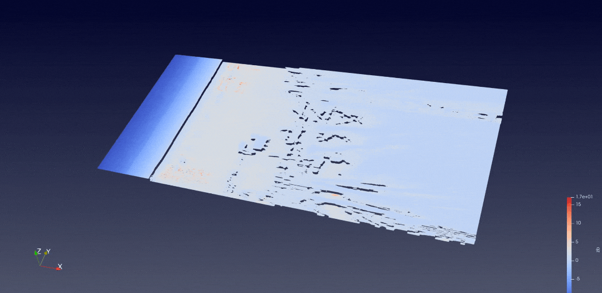

# Run Your First XBeach Simulation Example with Inductiva 

Welcome to Inductiva! Now that you’ve completed the [onboarding process](https://console.inductiva.ai/), 
it’s time to dive in and see how easy it is to run your first simulation!

In this tutorial, we’ll run a real-world simulation using the XBeach simulator through the Inductiva API. The use case is a study on beach and dune enhancement scenarios for Galveston Island, Texas.

All required input data for this simulation is [available here](https://data.griidc.org/data/HI.x833.000:0001).

By following this step-by-step guide, you will:

* Learn how to set up and execute a simulation using the Inductiva API.
* Use and select high-performance cloud machines.
* Access and manage simulation outputs via CLI and our [Web Console](https://console.inductiva.ai/).

<div style="
  border: 2px solid #007BFF; 
  background-color: rgba(0, 123, 255, 0.1); 
  padding: 15px; 
  border-radius: 8px; 
  margin: 20px 0;
  color: inherit;
">
  <h3 style="margin-top: 0; color: #ffffff; font-weight: bold;">
    🎥 Prefer a Visual Guide?
  </h3>
  <p>Follow along with our <strong>video walkthrough</strong> led by our CEO, where key details, features, and step-by-step instructions are explained in depth. It's a quick and engaging way to get started in no time!</p>
</div>

Let’s go!

## Prerequisites

Before starting, ensure the following:

* **Python Installed:** Make sure Python (>=3.9) is installed on your system. Check our [System Prep guide](https://docs.inductiva.ai/en/latest/preinstallation/system/system-requirements.html#select-your-os) for more information.
* **Inductiva API Setup:** 

    - Install the Inductiva library using `pip install inductiva`.
    - Authenticate your API key by [following these instructions](https://docs.inductiva.ai/en/latest/preinstallation/system/system-requirements.html#installing-the-inductiva-python-client-and-authenticating).


## Step 1: Prepare Your Project Directory

### Get Your Simulation Artifacts

1.	**Locate the Input Files**
   
    Download the necessary input files from the [Galveston Island dataset](https://data.griidc.org/data/HI.x833.000:0001#individual-files).

2.	**Navigate to the Correct Folder**

    Find the files under: *Files >> XBeach_Model_Runs >> Beach_Nourish_Only >> Input.*

3. Download all the files into a folder named **Beach_Nourish_Only** on your local machine.

### Adjust Simulation Parameters

1. **Open `params.txt`and modify the parameters**

    Ensure compatibility with XBeach v10+ by adding the following line after the header:

    `single_dir = 0`

    Reduce simulation time by changing the tstop value:

    `tstop = 34560`

### Create the Python Script (run.py)

Open your preferred IDE (e.g., VS Code, PyCharm) and save a new file as `run.py` in your project directory.

<div style="
  border: 2px solid #28A745; 
  padding: 15px; 
  background-color: rgba(40, 167, 69, 0.1); 
  border-radius: 8px; 
  margin: 20px 0;
  color: inherit;
">
  <h3 style="margin-top: 0; color: #ffffff; font-weight: bold;">
    💡 Pro Tip: Quick Creation of <code>run.py</code>
  </h3>
  <p>Instead of creating the file manually, you can use a shortcut:</p>
  <ul>
    <li>On <strong>Mac/Linux</strong>, type:  
      <code>touch run.py</code></li>
  </ul>
  <p>This will instantly create the <code>run.py</code> file in your current directory.</p>
</div>

### Organise Your Files

Ensure your directory structure looks like this:

```
xbeach/
|-- Beach_Nourish_Only/
    |-- README.txt
    |-- bed.dep
    |-- bedfricfile.txt
    ...
|-- run.py
```

* The `beach_nourish_only` folder contains all simulation artifacts.

* The`run.py` file which will contain your script to execute the simulation.

## Step 2: Write the Python Script

In the empty `run.py` file you've created, add the following code, save, and close!

```py
# Start by importing the required Inductiva library
import inductiva

# Define the machine group
machine_group = inductiva.resources.MachineGroup(
    machine_type="c3d-highcpu-90",
    spot=True, # Enables cost-saving spot mode
    data_disk_gb=20) 

# Specify the input directory
input_dir = "Beach_Nourish_Only"

# Initialize the Simulator
xbeach = inductiva.simulators.XBeach()

# Run simulation with config files in the input directory
task = xbeach.run(
    input_dir=input_dir,
    sim_config_filename="params.txt",
    n_vcpus=90,
    on=machine_group)

task.wait()

# Clean up resources after the simulation
machine_group.terminate()

# Get a small summary of the run
task.print_summary()

```
`The task.wait()` command blocks execution and will only return once the simulation is complete.

However, you don’t need to keep your terminal open the entire time!

- You **can safely close your terminal**, and the simulation will continue running in the cloud.
- To check the simulation status from another terminal, use the Inductiva CLI (Command Line Interface) tools.

## Step 3: Run the Simulation

### Execute the Script

Run the script from your terminal:

```bash
python3 run.py
```


The script will:

- Authenticate your API key.
- Start the specified cloud machine in spot mode.
- Zip and upload simulation files to Inductiva servers
- Execute the simulation on the cloud.
- Terminate the machine once the simulation completes.

### View Task Details

#### **In the Command Line** 

Use the inductiva logs command to view simulation logs:

```bash
inductiva logs <TASK_ID>
```
<div style="
  border: 2px solid #FFA500; 
  background-color: rgba(255, 165, 0, 0.1); 
  padding: 15px; 
  border-radius: 8px; 
  margin: 20px 0;
  color: inherit;
">
  <h3 style="margin-top: 0; color: #ffffff; font-weight: bold;">
    🔎 Understanding the Task ID
  </h3>
  <p>Each simulation you run is assigned a unique <strong>Task ID</strong>.</p>
  <p>This is the long alphanumeric sequence visible in the command line output when starting a simulation.</p>
  <p>You’ll need this ID to check logs, monitor progress, or retrieve results using the Inductiva API.</p>
</div>

#### **In the Web Console** 

In the [Inductiva Web Console](https://console.inductiva.ai/), the [Tasks](https://console.inductiva.ai/tasks) section provides a complete overview of your simulation runs.


🔹 Task Overview
* See a list of all your simulation tasks, including their status.
* Click on any task to access its Task ID and execution details.

🔹 Detailed Task Insights
* Simulation duration, cost breakdown, machine group details, and much more.
* Step-by-step timeline of the task lifecycle, from start to completion, with timestamps.

🔹 Task Logs & Debugging
* Real-time logs to track simulation progress.
* View error messages for troubleshooting if anything goes wrong.

<div style="
  border: 2px solid #17A2B8; 
  background-color: rgba(23, 162, 184, 0.1); 
  padding: 15px; 
  border-radius: 8px; 
  margin: 20px 0;
  color: inherit;
">
  <h3 style="margin-top: 0; color: #ffffff; font-weight: bold;">
    ℹ️ Good to Know
  </h3>
  <ul>
    <li>The <strong>Auto-Refresh</strong> feature updates the simulation status every <strong>15 seconds</strong>, ensuring you always have the latest progress.</li>
    <li>You can <strong>terminate a running simulation</strong> directly from the Web Console if needed—no need to switch back to the command line.</li>
  </ul>
</div>

## Step 4: Access Your Simulation Outputs

All simulation output files are securely stored in your exclusive folder on Inductiva’s cloud platform. If the simulation is interrupted, all progress up to that point is saved, so you can still access and use partial results.

✅ Private & Secure – Only you have access to your simulation results.

✅ Available Anytime – Download your files whenever you need them.

You can retrieve your results via:

- **[Web Console](https://console.inductiva.ai/)** → Navigate to your task and download the output files.
- **Command Line** → Use Inductiva’s CLI to fetch results directly.

<div style="
  border: 2px solid #17A2B8; 
  background-color: rgba(23, 162, 184, 0.1); 
  padding: 15px; 
  border-radius: 8px; 
  margin: 20px 0;
  color: inherit;
">
  <h3 style="margin-top: 0; color: #ffffff; font-weight: bold;">
    ℹ️ Good To Know
  </h3>
  <ul>
    <li>🔁 <strong>Reusing Outputs</strong> – You can use the results of one simulation as inputs for another, enabling iterative workflows.</li>
  </ul>
  <p>Learn more in our <a href="https://tutorials.inductiva.ai/how_to/reuse-files.html" style="color: #007BFF;">documentation</a> on chaining simulations.</p>
</div>

### Cost Management

- Spot mode significantly reduces costs (~85 cents for this example).

- Idle machines are automatically shut down after 30 minutes to prevent unexpected charges.

## Happy Simulating!

By completing this tutorial, you’ve successfully run an advanced XBeach simulation using the Inductiva API. 

<h3>🌊 XBeach Simulation Visualization</h3>
<p align="center">
  
</p>
<p align="center"><i>3D visualization of the XBeach simulation results, showcasing coastal dynamics and seabed changes over time.</i></p>

Now that your simulation is complete, you can choose any visualization tool to process, analyze, and present your results. For our demo, we used [ParaView](https://www.paraview.org/) to generate a 3D visualization of the XBeach simulation results.

### What's Next?

🔹 Discover More Use Cases

Explore other use cases available on the [Inductiva Tutorials Page](https://tutorials.inductiva.ai/index.html). 

🔹 Explore Other Simulators

Inductiva provides a **growing range of simulators** built into the API, covering **coastal dynamics**, **fluid simulations**, **physics-based modeling, and more**. Check out our [Simulators Page](https://inductiva.ai/simulators) to discover more options.

🔹 Browse Powerful Computational Resources

Inductiva gives you access to **high-performance cloud computing** with optimized machine configurations for various simulation workloads. Explore [available computational resources](https://github.com/inductiva/inductiva/releases#listmachines) to find the best setup for your needs.

If you encounter issues, refer to the [documentation](https://docs.inductiva.ai/en/latest/) or contact support at support@inductiva.ai.

Happy simulating!