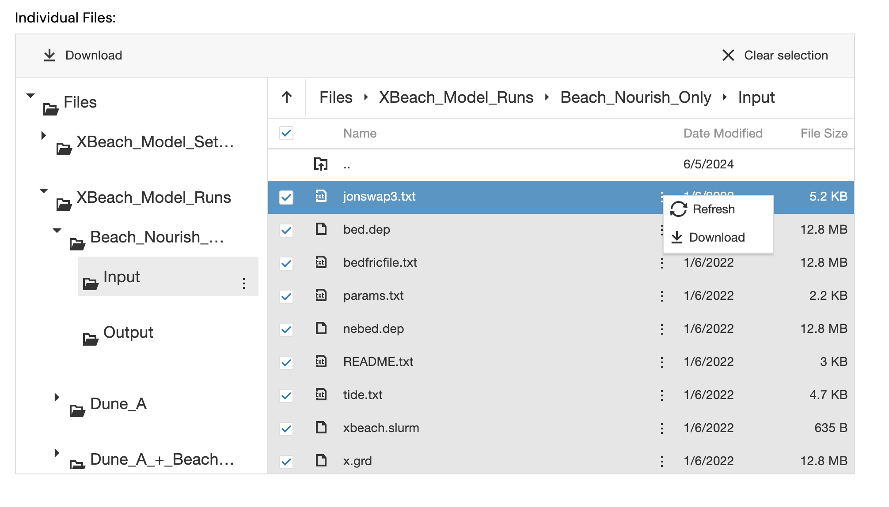

In this guide, we will walk you through setting up and running XBeach using 
the Inductiva API. 

We will cover:

- Configuring XBeach simulations using the Inductiva API.
- Example code to help you get started with simulations.
- An advanced example (Galveston Island Beach and Dune Simulation)
- Available benchmarks to test XBeach’s capabilities.


# XBeach

XBeach is a two-dimensional simulator used for modeling **wave propagation**, 
**sediment transport**, and **morphological changes** in the nearshore environment. 

XBeach is configured using a params.txt file, which contains crucial details 
like the grid, bathymetry, wave input, and flow parameters. The absence 
of a `params.txt` file will prevent the simulator from running, so it is 
essential to ensure all necessary files are in place.

The configuration also involves using additional files like `bed.dep` for 
bathymetry and other files to further customize the simulation within 
`params.txt`. 

We recommend setting the `mpiboundary` argument in the `params.txt` file 
to facilitate automatic parallelization based on the number of available 
CPU cores.

## Example Code

Below is an example of running a basic XBeach simulation via the Inductiva 
API:

```{literalinclude} ../../examples/xbeach/xbeach.py
:language: python
```

## Advanced Example: Galveston Island Simulation

In this example, we’ll run an extensive simulation using configuration scripts and data from [GRIIDC](https://www.griidc.org/), a repository at Texas A&M University-Corpus Christi’s Harte Research Institute for Gulf of Mexico Studies.

### Prerequisites

1. **Download Input Files**: We'll use a dataset from "XBeach model setup and results for beach and dune enhancement scenarios on Galveston Island, Texas," available [here](https://data.griidc.org/data/HI.x833.000:0001).

1. Go to the [dataset page](https://data.griidc.org/data/HI.x833.000:0001#individual-files).
2. Under **Files >> XBeach_Model_Runs >> Beach_Nourish_Only >> Input**, download all files in this directory:
   
3. Place these files in a `Beach_Nourish_Only` folder, resulting in a structure like:

	```
	ls -las Beach_Nourish_Only 
	total 130976
    0 drwxr-xr-x   12 paulobarbosa  staff       384 Nov  6 10:15 .
    0 drwx------@ 124 paulobarbosa  staff      3968 Nov  6 10:14 ..
    8 -rw-r--r--@   1 paulobarbosa  staff      3069 Nov  6 10:14 README.txt
26184 -rw-r--r--@   1 paulobarbosa  staff  13404906 Nov  6 10:14 bed.dep
26184 -rw-r--r--@   1 paulobarbosa  staff  13404906 Nov  6 10:14 bedfricfile.txt
   16 -rw-r--r--@   1 paulobarbosa  staff      5324 Nov  6 10:13 jonswap3.txt
26184 -rw-r--r--@   1 paulobarbosa  staff  13404906 Nov  6 10:14 nebed.dep
    8 -rw-r--r--@   1 paulobarbosa  staff      2296 Nov  6 10:15 params.txt
   16 -rw-r--r--@   1 paulobarbosa  staff      4850 Nov  6 10:14 tide.txt
26184 -rw-r--r--@   1 paulobarbosa  staff  13404906 Nov  6 10:14 x.grd
    8 -rw-r--r--@   1 paulobarbosa  staff       635 Nov  6 10:14 xbeach.slurm
26184 -rw-r--r--@   1 paulobarbosa  staff  13404906 Nov  6 10:14 y.grd
	```

### Overview

Here’s the code you'll be working on as we progress through the tutorial. Don’t
worry if it doesn’t all make sense right now; everything will become clearer
in the upcoming steps.

```python
import inductiva

machine_group = inductiva.resources.MachineGroup(
    machine_type="c3d-highcpu-90",
    spot=True,
    data_disk_gb=20)
machine_group.start()

input_dir = "Beach_Nourish_Only"

# Initialize the Simulator
xbeach = inductiva.simulators.XBeach()

# Run simulation with config files in the input directory
task = xbeach.run(
    input_dir=input_dir,
    sim_config_filename="params.txt",
    n_vcpus=90,
    on=machine_group)

# task.wait() is a blocking call and will only return when the simulation
# ends. However, you can close your terminal without interrupting the 
# simulation and use Inductiva CLI (Command Line Interface) tools to
# check the status of the simulation from another terminal.
task.wait()

# Terminate your dedicated MachineGroup at then end of the simulation.
machine_group.terminate()

# Let's get a small summary of the run.
task.print_summary()
```

### Step 1: Adjust Simulation Parameters
For a faster simulation, modify the `params.txt` file:

- Add `single_dir = 0` after the header (Needed because we are running XBeach v10+).
- Change `tstop` to `34560` for a shorter simulation.


### Step 2: Running the Simulation

#### a. Configure and Start Machine

1. **Pick your machine**:

	In this simulation, we'll use a `c3d-highcpu-90` machine with a 20 GB disk.
	

	```python
	import inductiva
	machine_group = inductiva.resources.MachineGroup(
		machine_type="c3d-highcpu-90",
		spot=True,
		data_disk_gb=20)
	```
	**Note**: `spot` machines are a lot cheaper but can be terminated by the
	provider if needed.

2. **Start your machine**
	```python
	machine_group.start()
	```

#### b. Define Simulation Inputs

1. **Specify Simulation Directory**:
	Let's start by defining a variable that points to the `Beach_Nourish_Only`
	folder where all your simulation files are located.

	```python
	input_dir = "Beach_Nourish_Only"
	```

#### c. Run Your Simulation

1. **Run the simulation**:
	We now have everything we need to run our simulation.
	```python
	# Initialize the Simulator
	xbeach = inductiva.simulators.XBeach()

	# Run simulation with config files in the input directory
	task = xbeach.run(
		input_dir=input_dir,
		sim_config_filename="params.txt",
		n_vcpus=90,
		on=machine_group)
	```

	In this snippet, two arguments might need clarification:

	- `n_vcpus`: This sets the number of virtual CPUs (vCPUs) for your simulation,
	essentially determining how many parts your simulation will be split into to
	run in parallel. Here, we’re dividing the simulation into 56 parts and running
	each part simultaneously.


2. **Wait for the simulation to finish**:
	That is it. Our simulation is now running on the cloud. We can `wait` for the
	simulation to finish while we grab a coffee (☕️).
	```python
	task.wait()
	```
	**Note**: run `inductiva logs task_id` to check the `stdout` of the simulation
	process in real time.

3. **Terminate Machine**:
	Once our simulation completes, we can/should terminate our machine to save on costs.
	If you forget, don’t worry—we’ve got you covered. By default, the machine will 
	automatically shut down if idle for 30 minutes with no simulation running.


	```python
	machine_group.terminate()
	```

4. **Check your simulation summary**:
	Now that our simulation is complete, we can print a summary with key details, 
	including execution times, generated outputs, and more.

	```python
	task.print_summary()
	```

### Conclusion

Running the simulation on a high-performance machine it's simple and easy. And the great benefit is that you can run multiple simulations in parallel, saving you time and money. You can also seamlessly udate the machine you run your simulation. Scaling it up or down as you need. 

Download and analyze your results locally once complete. 

Happy simulations!

## Available Benchmarks for XBeach

To better understand how you can optimize your XBeach runs, check out 
our benchmark:

- [Cova Gala Beach Simulation](https://benchmarks.inductiva.ai/Xbeach/cova_gala/): 
This benchmark demonstrates XBeach’s performance across different 
hardware configurations for simulating coastal erosion at [Cova Gala](https://www.visitportugal.com/pt-pt/content/praia-da-cova-gala) Beach 
in Portugal, an area known for high erosion rates.